# NVIDIA CLI - Technical Deep Dive

This document provides an in-depth technical overview of the NVIDIA CLI architecture, implementation details, and extension points.

---

## Table of Contents

1. [System Architecture](#system-architecture)
2. [NVIDIA NIM Integration](#nvidia-nim-integration)
3. [Agent System](#agent-system)
4. [State Management](#state-management)
5. [Artifact System](#artifact-system)
6. [Real-time Streaming](#real-time-streaming)
7. [Security Model](#security-model)

---

## System Architecture

### High-Level Architecture

```
┌────────────────────────────────────────────────────────────────────────────────┐
│                              NVIDIA CLI Application                             │
├────────────────────────────────────────────────────────────────────────────────┤
│                                                                                 │
│  ┌─────────────────────────────────────────────────────────────────────────┐   │
│  │                         Presentation Layer                               │   │
│  │  ┌──────────┐ ┌──────────┐ ┌──────────┐ ┌──────────┐ ┌──────────┐      │   │
│  │  │  Header  │ │ Sidebar  │ │   Chat   │ │ Artifact │ │ Settings │      │   │
│  │  └──────────┘ └──────────┘ └──────────┘ └──────────┘ └──────────┘      │   │
│  └─────────────────────────────────────────────────────────────────────────┘   │
│                                      │                                          │
│  ┌─────────────────────────────────────────────────────────────────────────┐   │
│  │                          State Layer (Zustand)                           │   │
│  │  ┌────────────┐ ┌────────────┐ ┌────────────┐ ┌────────────┐           │   │
│  │  │Conversation│ │     UI     │ │  Settings  │ │   Agent    │           │   │
│  │  │   Store    │ │   Store    │ │   Store    │ │   Store    │           │   │
│  │  └────────────┘ └────────────┘ └────────────┘ └────────────┘           │   │
│  └─────────────────────────────────────────────────────────────────────────┘   │
│                                      │                                          │
│  ┌─────────────────────────────────────────────────────────────────────────┐   │
│  │                           Service Layer                                  │   │
│  │  ┌────────────┐ ┌────────────┐ ┌────────────┐ ┌────────────┐           │   │
│  │  │   NVIDIA   │ │   Agent    │ │   Tool     │ │  Terminal  │           │   │
│  │  │   Client   │ │   Core     │ │  Registry  │ │   Server   │           │   │
│  │  └────────────┘ └────────────┘ └────────────┘ └────────────┘           │   │
│  └─────────────────────────────────────────────────────────────────────────┘   │
│                                      │                                          │
│  ┌─────────────────────────────────────────────────────────────────────────┐   │
│  │                         Persistence Layer                                │   │
│  │  ┌────────────────────────┐    ┌────────────────────────┐               │   │
│  │  │     LocalStorage       │    │    SQLite (Prisma)     │               │   │
│  │  │  (Zustand Persist)     │    │   (Future: Postgres)   │               │   │
│  │  └────────────────────────┘    └────────────────────────┘               │   │
│  └─────────────────────────────────────────────────────────────────────────┘   │
│                                                                                 │
└────────────────────────────────────────────────────────────────────────────────┘
                                       │
                                       ▼
┌────────────────────────────────────────────────────────────────────────────────┐
│                            External Services                                    │
│  ┌────────────────────────┐                                                    │
│  │    NVIDIA NIM API      │                                                    │
│  │  integrate.api.nvidia  │                                                    │
│  └────────────────────────┘                                                    │
└────────────────────────────────────────────────────────────────────────────────┘
```

### Request Flow

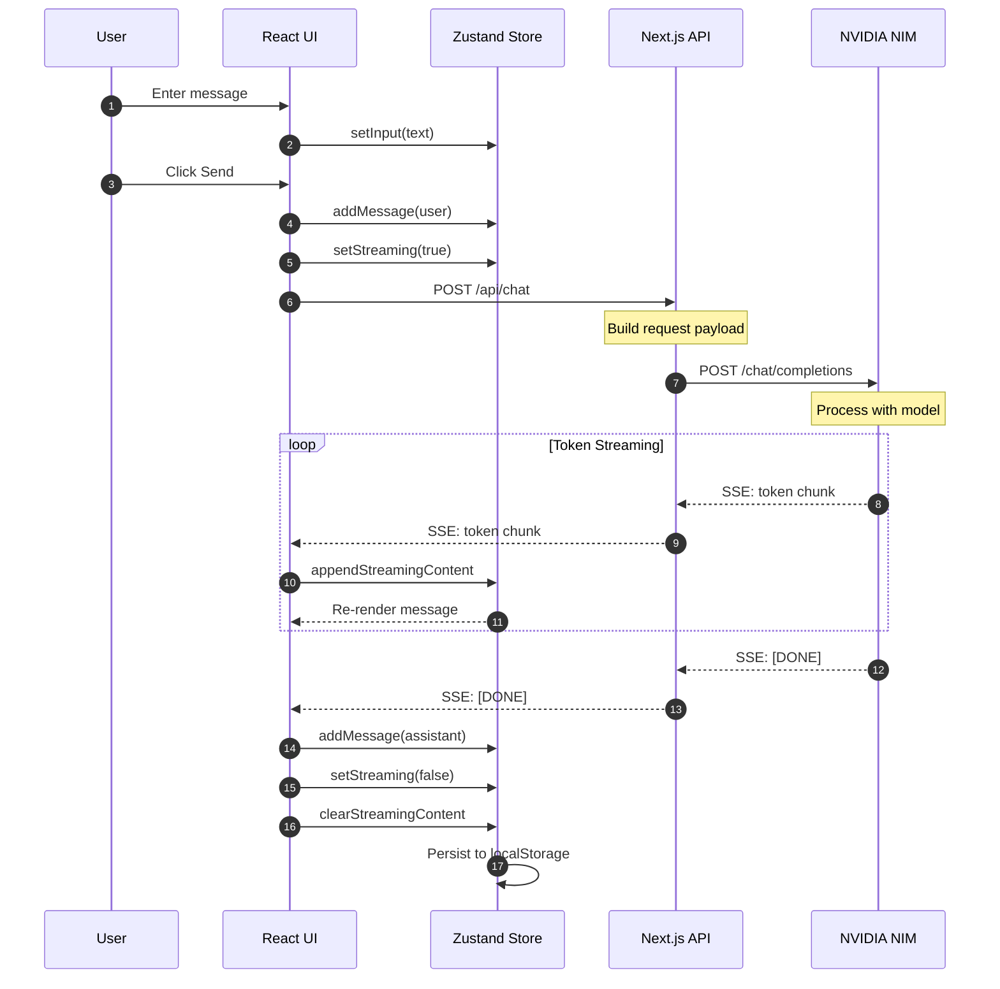

---

## NVIDIA NIM Integration

### Client Configuration

```typescript
// lib/nvidia.ts

import OpenAI from "openai";

const client = new OpenAI({
  baseURL: "https://integrate.api.nvidia.com/v1",
  apiKey: process.env.NVIDIA_API_KEY,
});
```

### Model Capabilities Matrix

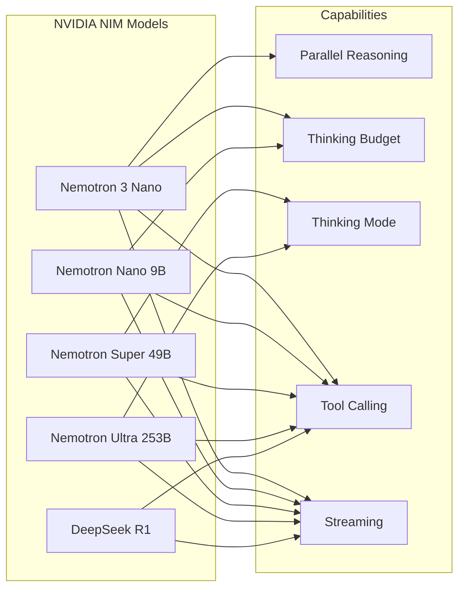

### Thinking Mode Implementation

```typescript
// Different models handle thinking differently

// Nemotron 3 Nano - Uses thinking_config
const response = await client.chat.completions.create({
  model: "nvidia/nemotron-3-nano",
  messages,
  extra_body: {
    thinking_config: {
      type: "enabled",
      budget_tokens: 8192,  // Control reasoning depth
    }
  }
});

// Nemotron Super 49B v1.5 - Uses /no_think in prompt
const messages = [
  { role: "system", content: "/no_think" },  // Disable thinking
  { role: "user", content: userMessage }
];

// Nemotron Ultra 253B - Uses system prompt
const messages = [
  { role: "system", content: "detailed thinking off" },
  { role: "user", content: userMessage }
];
```

### Parallel Reasoning (Nemotron 3 Nano)

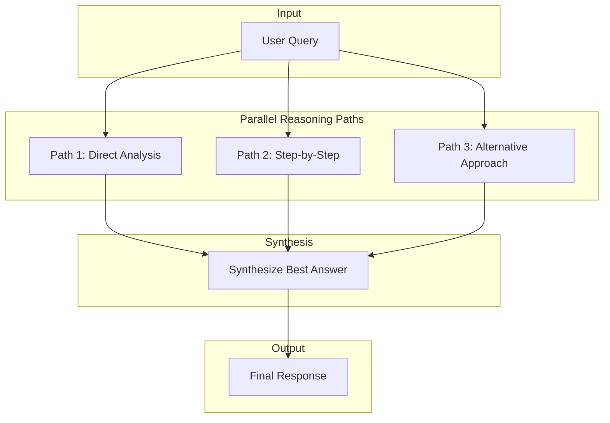

---

## Agent System

### Agent Core Architecture

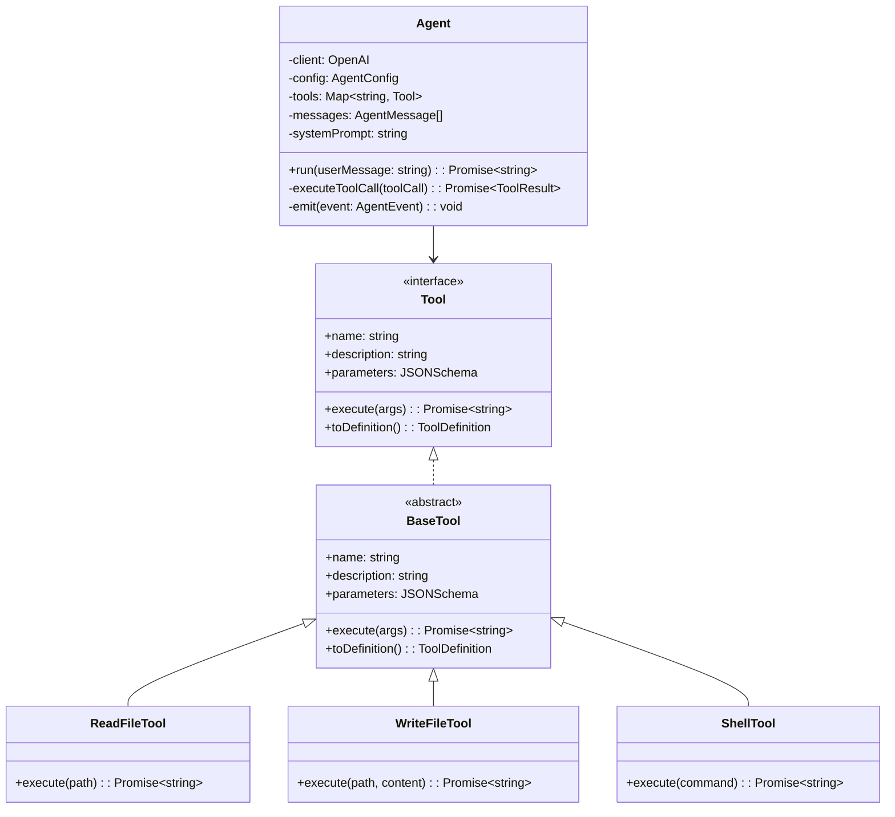

### Agent Execution Loop

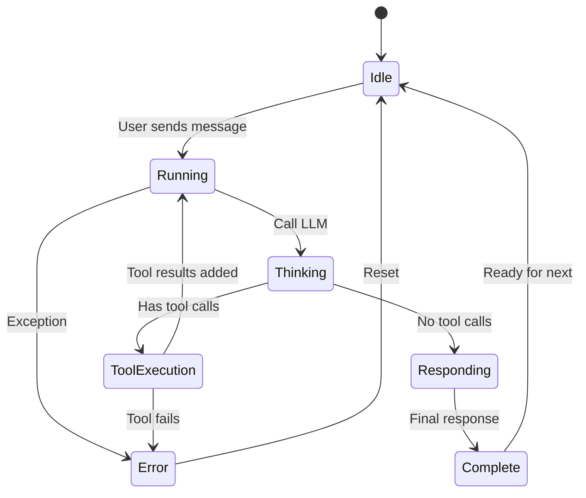

### Tool Definition Schema

```typescript
interface ToolDefinition {
  type: "function";
  function: {
    name: string;
    description: string;
    parameters: {
      type: "object";
      properties: Record<string, {
        type: string;
        description: string;
        enum?: string[];
      }>;
      required: string[];
    };
  };
}

// Example: Read File Tool
const readFileTool: ToolDefinition = {
  type: "function",
  function: {
    name: "read_file",
    description: "Read the contents of a file at the given path",
    parameters: {
      type: "object",
      properties: {
        path: {
          type: "string",
          description: "The path to the file to read"
        }
      },
      required: ["path"]
    }
  }
};
```

### Agent Types

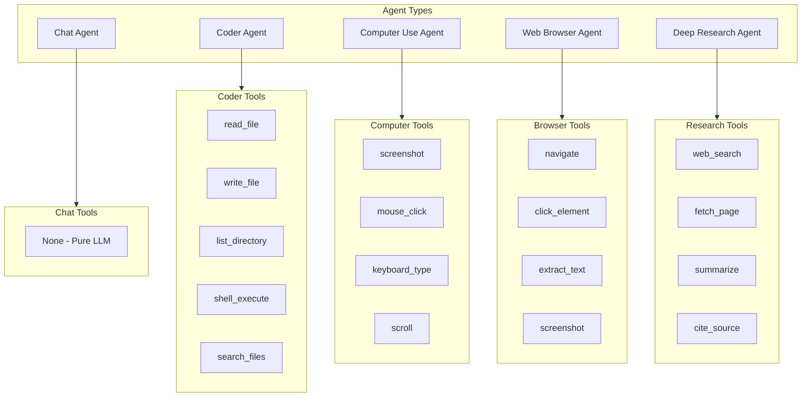

---

## State Management

### Store Structure

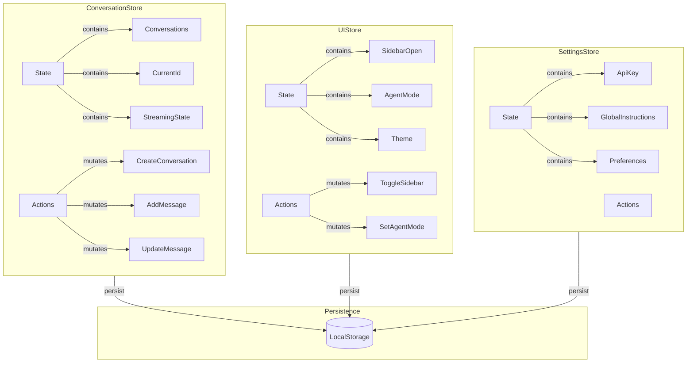

### Zustand Store Pattern

```typescript
// Store with persistence
export const useConversationStore = create<ConversationState>()(
  persist(
    (set, get) => ({
      // State
      conversations: [],
      currentConversationId: null,
      isStreaming: false,
      streamingContent: "",
      
      // Actions
      createConversation: (projectId) => {
        const id = nanoid();
        const conversation: Conversation = {
          id,
          title: "New Conversation",
          model: "nvidia/nemotron-3-nano",
          messages: [],
          // ... defaults
        };
        
        set((state) => ({
          conversations: [conversation, ...state.conversations],
          currentConversationId: id,
        }));
        
        return id;
      },
      
      addMessage: (conversationId, message) => {
        set((state) => ({
          conversations: state.conversations.map((c) =>
            c.id === conversationId
              ? {
                  ...c,
                  messages: [...c.messages, message],
                  updatedAt: new Date(),
                  lastMessageAt: new Date(),
                }
              : c
          ),
        }));
      },
      
      // ... more actions
    }),
    {
      name: "nvidia-cli-conversations",
      storage: createJSONStorage(() => localStorage),
      partialize: (state) => ({
        conversations: state.conversations,
        currentConversationId: state.currentConversationId,
      }),
    }
  )
);
```

---

## Artifact System

### Artifact Types

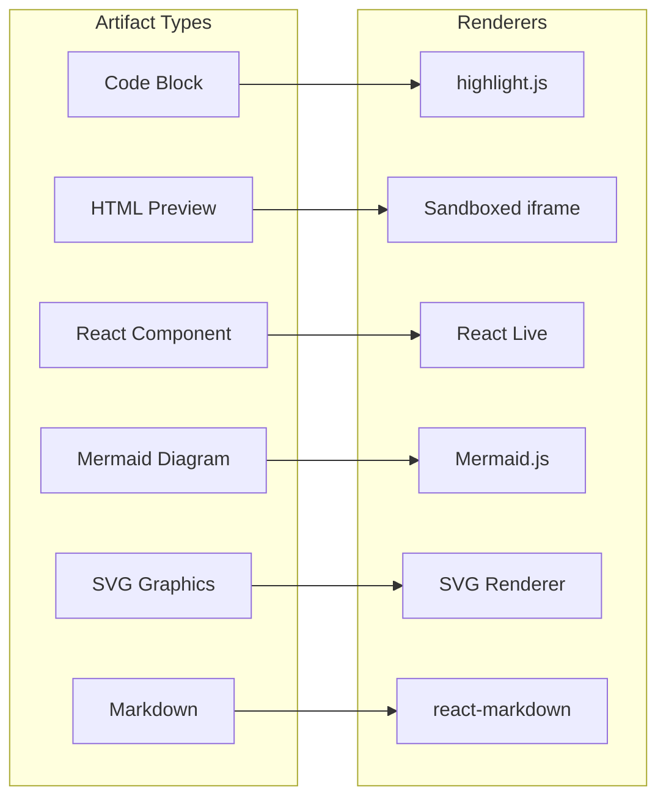

### Artifact Detection

```typescript
// Detect artifacts in assistant response
function extractArtifacts(content: string): Artifact[] {
  const artifacts: Artifact[] = [];
  
  // Code blocks with language
  const codeRegex = /```(\w+)?\n([\s\S]*?)```/g;
  let match;
  
  while ((match = codeRegex.exec(content)) !== null) {
    const language = match[1] || "text";
    const code = match[2];
    
    artifacts.push({
      id: nanoid(),
      title: `${language} code`,
      type: detectArtifactType(language, code),
      language,
      content: code,
      version: 1,
      createdAt: new Date(),
    });
  }
  
  return artifacts;
}

function detectArtifactType(language: string, code: string): ArtifactType {
  if (language === "mermaid") return "mermaid";
  if (language === "html" || code.includes("<!DOCTYPE")) return "html";
  if (language === "svg" || code.startsWith("<svg")) return "svg";
  if (language === "jsx" || language === "tsx") return "react";
  if (language === "markdown" || language === "md") return "markdown";
  return "code";
}
```

### Artifact Panel

```
┌─────────────────────────────────────────┐
│  Artifact Panel                    [×]  │
├─────────────────────────────────────────┤
│  ┌─────────────────────────────────┐    │
│  │ [Code] [Preview] [Raw]          │    │
│  └─────────────────────────────────┘    │
│                                         │
│  ┌─────────────────────────────────┐    │
│  │                                 │    │
│  │     Rendered Content            │    │
│  │                                 │    │
│  │     (Code highlighting,         │    │
│  │      HTML preview,              │    │
│  │      Mermaid diagram,           │    │
│  │      React component)           │    │
│  │                                 │    │
│  └─────────────────────────────────┘    │
│                                         │
│  ┌─────────────────────────────────┐    │
│  │ [Copy] [Download] [Fullscreen]  │    │
│  └─────────────────────────────────┘    │
└─────────────────────────────────────────┘
```

---

## Real-time Streaming

### SSE Implementation

```typescript
// API Route: app/api/chat/route.ts

export async function POST(req: Request) {
  const { messages, model, temperature, max_tokens } = await req.json();
  
  const stream = await client.chat.completions.create({
    model,
    messages,
    temperature,
    max_tokens,
    stream: true,
  });
  
  // Create SSE response
  const encoder = new TextEncoder();
  const readable = new ReadableStream({
    async start(controller) {
      for await (const chunk of stream) {
        const content = chunk.choices[0]?.delta?.content || "";
        if (content) {
          controller.enqueue(
            encoder.encode(`data: ${JSON.stringify({ content })}\n\n`)
          );
        }
      }
      controller.enqueue(encoder.encode("data: [DONE]\n\n"));
      controller.close();
    },
  });
  
  return new Response(readable, {
    headers: {
      "Content-Type": "text/event-stream",
      "Cache-Control": "no-cache",
      "Connection": "keep-alive",
    },
  });
}
```

### Client-side Streaming

```typescript
// Consume SSE stream
async function streamChat(messages: Message[]) {
  const response = await fetch("/api/chat", {
    method: "POST",
    headers: { "Content-Type": "application/json" },
    body: JSON.stringify({ messages, model, stream: true }),
  });
  
  const reader = response.body?.getReader();
  const decoder = new TextDecoder();
  
  while (true) {
    const { done, value } = await reader!.read();
    if (done) break;
    
    const chunk = decoder.decode(value);
    const lines = chunk.split("\n");
    
    for (const line of lines) {
      if (line.startsWith("data: ")) {
        const data = line.slice(6);
        if (data === "[DONE]") {
          // Stream complete
          return;
        }
        
        const { content } = JSON.parse(data);
        appendStreamingContent(content);
      }
    }
  }
}
```

### Streaming State Machine

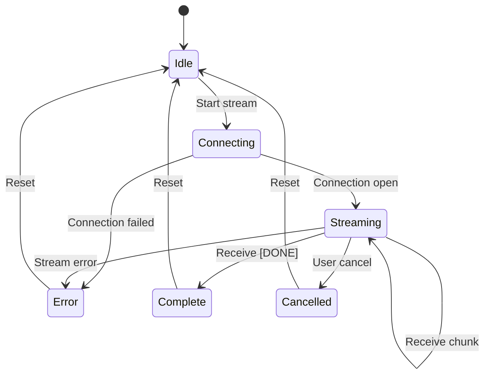

---

## Security Model

### API Key Handling

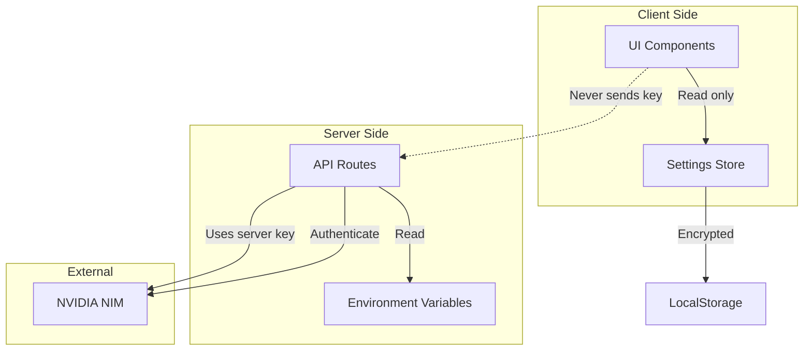

### Security Measures

1. **API Key Storage**
   - Server-side: Environment variables only
   - Client-side: Encrypted in localStorage (optional)
   - Never transmitted in client requests

2. **Artifact Sandboxing**
   - HTML rendered in sandboxed iframe
   - React components in isolated scope
   - No access to parent window

3. **Input Validation**
   - Zod schema validation on all inputs
   - Sanitized markdown rendering
   - XSS prevention in artifact display

4. **Rate Limiting**
   - Client-side debouncing
   - Server-side rate limits (future)

---

## Performance Optimizations

### Rendering Optimizations

```typescript
// Memoized message component
const ChatMessage = React.memo(({ message, onEdit, onRegenerate }) => {
  // Only re-render when message changes
  return (
    <div className="message">
      <MessageContent content={message.content} />
      <MessageActions onEdit={onEdit} onRegenerate={onRegenerate} />
    </div>
  );
}, (prev, next) => {
  return prev.message.id === next.message.id &&
         prev.message.content === next.message.content;
});

// Virtualized message list for long conversations
const MessageList = ({ messages }) => {
  return (
    <VirtualList
      height={600}
      itemCount={messages.length}
      itemSize={getMessageHeight}
      overscanCount={5}
    >
      {({ index, style }) => (
        <div style={style}>
          <ChatMessage message={messages[index]} />
        </div>
      )}
    </VirtualList>
  );
};
```

### Bundle Optimization

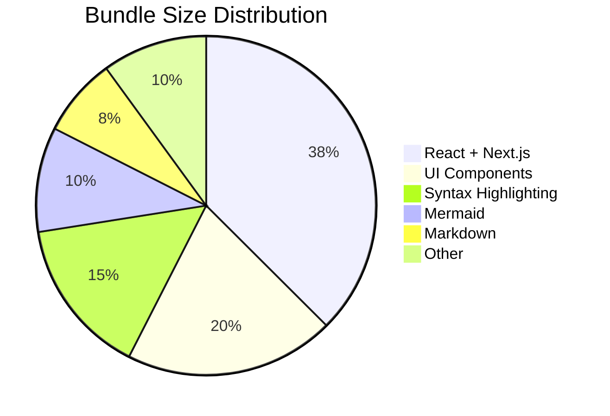

---

## Extension Points

### Adding New Models

```typescript
// lib/nvidia.ts - Add to NVIDIA_MODELS
export const NVIDIA_MODELS = {
  // ... existing models
  
  "new-vendor/new-model": {
    id: "new-vendor/new-model",
    name: "New Model Name",
    description: "Model description",
    contextWindow: 128000,
    maxTokens: 16384,
    supportsTools: true,
    supportsImages: false,
    supportsStreaming: true,
  },
};
```

### Adding New Tools

```typescript
// lib/agents/tools/my-tool.ts
import { BaseTool } from "../base-tool";

export class MyCustomTool extends BaseTool {
  name = "my_custom_tool";
  description = "Description of what this tool does";
  parameters = {
    type: "object" as const,
    properties: {
      input: {
        type: "string",
        description: "The input parameter",
      },
    },
    required: ["input"],
  };

  async execute(args: { input: string }): Promise<string> {
    // Tool implementation
    return `Result: ${args.input}`;
  }
}
```

### Adding New Artifact Types

```typescript
// components/artifacts/renderers/my-renderer.tsx
export function MyArtifactRenderer({ content }: { content: string }) {
  // Custom rendering logic
  return (
    <div className="my-artifact">
      {/* Render content */}
    </div>
  );
}

// Register in artifact-panel.tsx
const renderers: Record<ArtifactType, React.ComponentType> = {
  // ... existing renderers
  "my-type": MyArtifactRenderer,
};
```

---

<p align="center">
  <em>For more information, see the main <a href="README.md">README</a></em>
</p>
