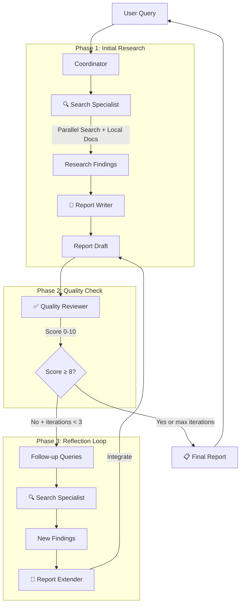
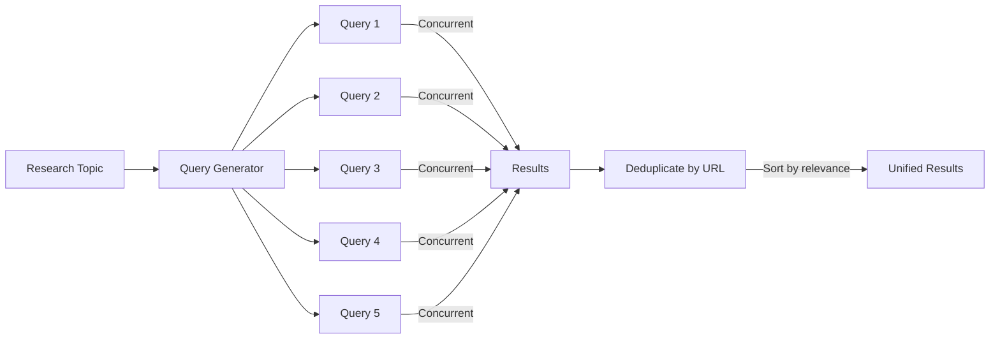
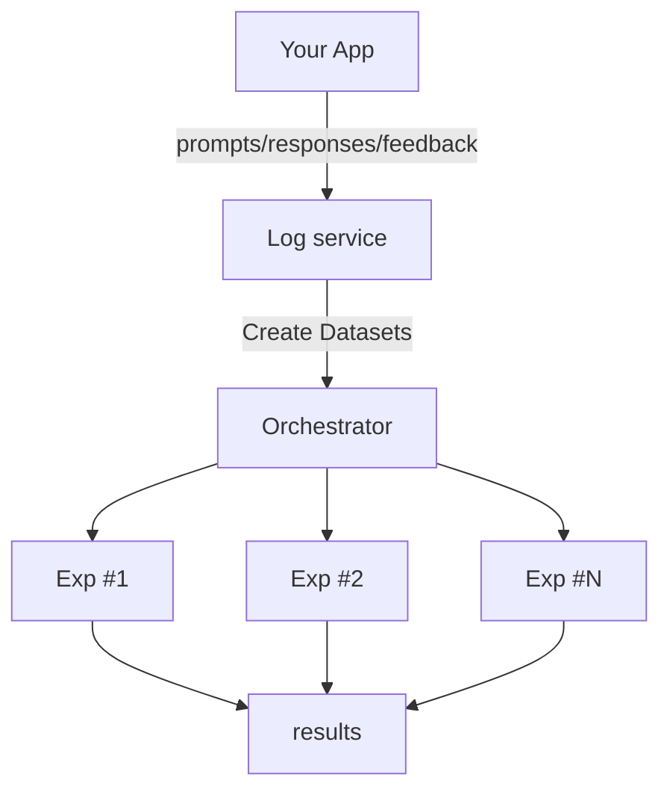
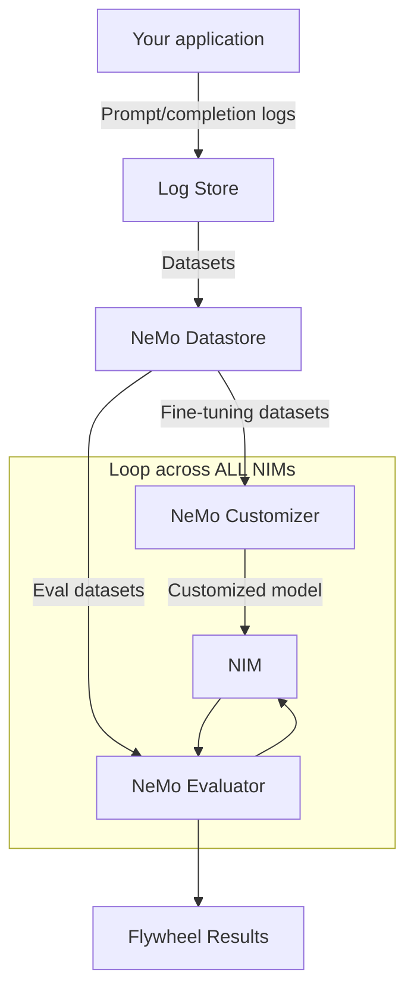
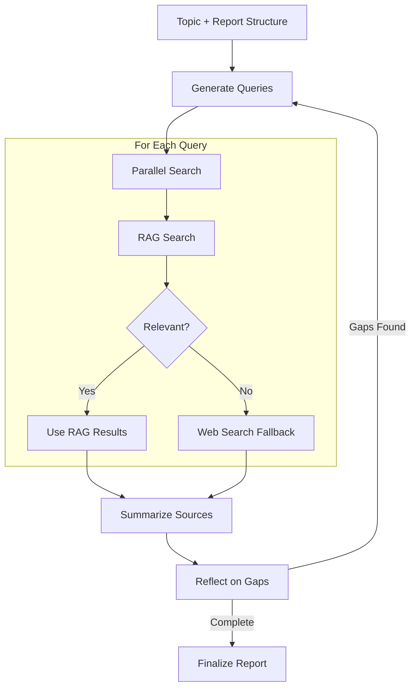
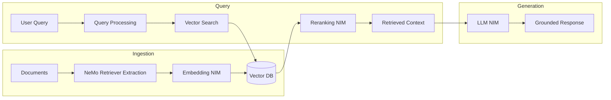

<p align="center">
  
</p>

<h1 align="center">NVIDIA CLI</h1>

<p align="center">
  <strong>A powerful, privacy-first AI assistant powered by NVIDIA NIM</strong>
</p>

<p align="center">
  <a href="#features">Features</a> •
  <a href="#modes">Modes</a> •
  <a href="#multi-agent-coordinator">Multi-Agent</a> •
  <a href="#models">Models</a> •
  <a href="#getting-started">Getting Started</a> •
  <a href="#nvidia-blueprints-reference">Blueprints</a>
</p>

---

## Overview

NVIDIA CLI [codename: **dory**] is a full-featured application powered by NVIDIA's NIM (NVIDIA Inference Microservices) API. It provides a terminal-like interface with multiple agent modes, real tool execution, multi-agent coordination with reflection loops, and multi-model support.

**Default Model:** Nemotron 3 Nano 30B - 1M context, 3.3x faster throughput, optimized for reasoning

---

## Features

### 🎯 Core Chat
- **Multi-model support** - 10+ NVIDIA NIM models
- **Streaming responses** - Real-time token streaming with metrics (tok/s, total tokens, elapsed time)
- **Markdown rendering** - Full GFM support with syntax highlighting
- **Conversation management** - Create, rename, pin, archive, search
- **Conversation memory** - Maintains context across messages in session

### 🤖 Real Tool Execution
- **File operations** - Read, write, list directories
- **Shell commands** - Execute bash commands
- **Google Search** - FREE Google Custom Search API integration
- **Parallel Search** - Multiple queries executed concurrently
- **Local Docs Search** - Search dev-docs before falling back to web
- **Thinking** - Internal reasoning for complex problems

### 🔄 Multi-Agent Coordinator
- **Specialist Agents** - Search, Report Writer, Quality Reviewer, Report Extender
- **Reflection Loop** - Iterates until quality score ≥ 8/10
- **Parallel Search** - Multiple queries run concurrently
- **Source Deduplication** - Clean, numbered citations
- **Quality Scoring** - Completeness, Accuracy, Clarity, Citations, Depth

### 🎨 Artifacts
- **Code blocks** - Syntax highlighted with 50+ languages
- **HTML/CSS** - Live preview with sandboxed iframe
- **React components** - Live rendering
- **Mermaid diagrams** - Flowcharts, sequence diagrams
- **SVG graphics** - Vector graphics preview

### ⚙️ Advanced
- **Command palette** - Quick actions (Cmd+K)
- **Keyboard shortcuts** - Full keyboard navigation
- **Settings** - API key, theme, default model
- **Session management** - Running agents sidebar
- **Stop button** - Abort running agents at any time

---

## Modes

Switch modes from the header dropdown or input mode selector.

### 💬 Dory (Chat)
General-purpose assistant with full CLI file and command access.
```
[you] What files are in this directory?
⚡ file_read({"path": ".", "operation": "list"})
[dory] Found 12 files including package.json, src/, ...
```

### 💻 Coder Mode
**Autonomous coding agent** - Build entire apps from start to finish.

- Never overflows context window
- Compact memory across sessions
- Picks up exactly where it left off

**iOS Development Support:**
- Build: `xcodebuild -project *.xcodeproj -scheme * -destination 'generic/platform=iOS'`
- Codesign fix: `xattr -cr .` to strip extended attributes
- Team ID: 672RKF28YZ, Bundle prefix: caserlegal.[AppName]

### 🖥️ Controller Mode
Computer automation - open apps, run scripts, system commands.
```
[you] Open Safari and go to github.com
⚡ bash({"command": "open -a Safari https://github.com"})
```

### 🌐 Browser Mode
Web browsing assistant - search, fetch URLs, save content.

### 🔬 Research Mode
Deep research with parallel search and local docs.

**Tools available:**
- `google_search` - Single query search
- `parallel_search` - Multiple queries at once
- `local_docs_search` - Search dev-docs folder first

### 👥 Coordinator Mode (Multi-Agent)
**Multi-agent research coordinator with reflection loop.**

See [Multi-Agent Coordinator](#multi-agent-coordinator) section below.

---

## Multi-Agent Coordinator

The Coordinator mode orchestrates a team of specialist agents for comprehensive research with quality assurance.

### Architecture



### Specialist Agents

| Agent | Role | Tools |
|-------|------|-------|
| **Search Specialist** | Comprehensive web research | `parallel_search`, `local_docs_search`, `google_search` |
| **Report Writer** | Creates structured reports with citations | None (pure writing) |
| **Quality Reviewer** | Evaluates completeness, identifies gaps | None (pure evaluation) |
| **Report Extender** | Integrates new findings into existing reports | None (pure editing) |
| **Source Deduplicator** | Cleans up citation lists | None (utility) |

### Quality Scoring

The Quality Reviewer scores reports on 5 dimensions (0-10 each):

| Dimension | What it measures |
|-----------|------------------|
| **Completeness** | Does it fully answer the original question? |
| **Accuracy** | Are claims supported by cited sources? |
| **Clarity** | Is it well-organized and easy to understand? |
| **Citations** | Are sources properly cited and credible? |
| **Depth** | Is there sufficient detail and analysis? |

**Verdicts:**
- `APPROVED` - Ready for delivery (score ≥ 8)
- `NEEDS_REVISION` - Minor edits needed
- `NEEDS_MORE_RESEARCH` - Gaps identified, triggers reflection loop

### Reflection Loop

When the Quality Reviewer identifies gaps:

1. Extracts specific follow-up queries from the review
2. Search Specialist runs those queries
3. Report Extender integrates new findings (doesn't rewrite entire report)
4. Quality Reviewer re-evaluates
5. Repeats until APPROVED or max 3 iterations

### Parallel Search

The `parallel_search` tool executes multiple queries concurrently:



**Benefits:**
- 5x faster than sequential searches
- Results deduplicated by URL
- Sources found by multiple queries ranked higher
- Formatted citation block included

### Local Docs Search

Before searching the web, the system checks local documentation:

**Default paths searched:**
- `/Users/home/Documents/iOS/dev-docs` - iOS development docs
- `/Users/home/nvidia-cli/dev-docs.rtf` - NVIDIA NIM documentation

**Supported file types:** `.md`, `.txt`, `.swift`, `.ts`, `.py`, `.json`

This ensures existing knowledge is used before falling back to web search.

---

## Models

### Available Models (December 2024)

| Model | Context | Best For |
|-------|---------|----------|
| **Nemotron 3 Nano 30B** (default) | 1M | Fast reasoning, 3.3x throughput |
| **Nemotron Super 49B** | 128K | Agentic coding tasks |
| **Nemotron Ultra 253B** | 128K | Maximum capability |
| **Qwen3 Coder 480B** | 128K | Code generation specialist |
| **Devstral 2 123B** | 128K | Development tasks |
| **DeepSeek R1** | 128K | Math, reasoning |
| **DeepSeek V3.2** | 128K | Hybrid inference |
| **Llama 3.3 70B** | 128K | General purpose |
| **Qwen3 235B** | 128K | Strong reasoning |
| **Nemotron Nano VL 8B** | 128K | Vision/images |

### Model Configuration

For thinking/reasoning models (Nemotron):
- `temperature: 1.0` (required)
- `top_p: 1.0` (required)
- `maxTokens: 32768` (maximum for full reasoning output)

---

## Getting Started

### Prerequisites
- Node.js 18+
- NVIDIA API Key ([Get one free](https://build.nvidia.com))

### Installation

```bash
# Clone
git clone https://github.com/caser-legal/nvidia-cli.git
cd nvidia-cli

# Install
npm install

# Configure
cp .env.example .env.local
# Add your NVIDIA_API_KEY to .env.local

# Run
npm run dev
```

Open [http://localhost:3000](http://localhost:3000)

### Environment Variables

```env
NVIDIA_API_KEY=nvapi-xxxxxxxxxxxxxxxxxxxxxxxxxxxx
```

---

## API Reference

### Agent Chat Endpoint

```
POST /api/agent-chat
```

Supports all modes with real tool execution.

```typescript
// Request
{
  messages: [{ role: "user", content: "Research quantum computing" }],
  projectDir: "/path/to/project",
  mode: "chat" | "coder" | "computer" | "browser" | "research" | "coordinator"
}

// Response (SSE)
data: {"type":"status","status":"running"}
data: {"type":"tool_call","name":"search_specialist","args":"..."}
data: {"type":"tool_result","result":"..."}
data: {"type":"message","role":"assistant","content":"..."}
data: {"type":"done"}
```

### Chat Endpoint

```
POST /api/chat
```

Standard chat completion without tools.

---

## Tools

### Standard Tools (All Modes)

| Tool | Description |
|------|-------------|
| `file_read` | Read files, list directories |
| `file_write` | Create/edit files |
| `bash` | Execute shell commands |
| `think` | Internal reasoning |
| `google_search` | Search Google (FREE API) |

### Research Mode Tools

| Tool | Description |
|------|-------------|
| `parallel_search` | Execute multiple queries concurrently |
| `local_docs_search` | Search local dev-docs folder |

### Coordinator Mode Tools

| Tool | Description |
|------|-------------|
| `search_specialist` | Comprehensive research agent |
| `report_writer` | Creates structured reports |
| `quality_reviewer` | Evaluates report quality |
| `report_extender` | Integrates new findings |
| `deduplicate_sources` | Cleans up citations |

---

## Keyboard Shortcuts

| Shortcut | Action |
|----------|--------|
| `Cmd + K` | Command palette |
| `Cmd + N` | New conversation |
| `Cmd + /` | Toggle sidebar |
| `Cmd + ,` | Settings |
| `Enter` | Send message |
| `Shift + Enter` | New line |
| `Escape` | Close modal |

---

## Project Structure

```
nvidia-cli/
├── app/
│   ├── api/
│   │   ├── chat/              # Chat completion
│   │   └── agent-chat/        # Multi-mode agent with coordinator
│   ├── page.tsx
│   └── globals.css
├── components/
│   ├── agents/
│   │   ├── agent-chat.tsx     # Terminal UI for all modes
│   │   ├── coder-setup.tsx    # Coder mode setup
│   │   ├── coder-panel.tsx    # Coder progress & logs
│   │   └── terminal.tsx       # Direct terminal access
│   ├── chat/
│   │   ├── chat-input.tsx     # Input with mode selector
│   │   └── welcome-screen.tsx
│   ├── sidebar/
│   └── ui/
├── lib/
│   ├── agents/
│   │   ├── agent.ts           # Main agent loop
│   │   ├── types.ts           # TypeScript types
│   │   └── tools/
│   │       ├── google-search.ts
│   │       ├── parallel-search.ts      # NEW: Concurrent search
│   │       ├── local-docs-search.ts    # NEW: Dev-docs search
│   │       ├── specialist-agents.ts    # Multi-agent tools
│   │       ├── file-read.ts
│   │       ├── file-write.ts
│   │       ├── bash.ts
│   │       └── think.ts
│   ├── store/
│   │   ├── index.ts           # UI state
│   │   └── agent-sessions.ts  # Session management
│   └── nvidia.ts              # NIM client & models
└── public/
```

---

## NVIDIA Blueprints Reference

This project implements patterns from official NVIDIA AI Blueprints. Below is reference documentation for the underlying concepts.

### Data Flywheel Blueprint

The Data Flywheel is a process that uses production data to continuously improve AI models.



**Key Concepts:**
- **Log Schema**: Every LLM call logs `timestamp`, `workload_id`, `client_id`, `request`, `response`
- **Workload Tagging**: Each agent node/route gets a unique `workload_id`
- **Automated Experiments**: System tests base models, ICL (few-shot), and fine-tuned variants
- **LLM-as-Judge**: Evaluates model outputs for quality scoring

**Real-World Results:** NVIDIA found instances where a fine-tuned 1B model matched 70B quality for simple tool routing, reducing inference costs by 98.6%.

**NeMo Microservices Integration:**



**Reference:** [NVIDIA Data Flywheel Blueprint](https://github.com/NVIDIA-AI-Blueprints/data-flywheel)

---

### AI-Q Research Assistant Blueprint

The AI-Q Research Assistant creates deep research reports using on-premise data and web search.

**Key Features:**
- **Deep Research**: Plan → Search → Write → Reflect → Finalize
- **Parallel Search**: Multiple queries searched concurrently
- **RAG + Web Fallback**: Internal docs first, web search if needed
- **LLM-as-Judge Relevancy**: Scores if RAG results are relevant
- **Human-in-the-loop**: User can edit plan before execution

**Workflow:**



**Software Components:**
- NVIDIA NeMo Agent Toolkit (LangGraph)
- NVIDIA RAG Blueprint (multimodal document search)
- NVIDIA NIM Microservices (LLM inference)
- Tavily (web search)

**Reference:** [NVIDIA AI-Q Research Assistant](https://github.com/NVIDIA-AI-Blueprints/aiq-research-assistant)

---

### RAG Blueprint

Retrieval-Augmented Generation combines LLM reasoning with real-time retrieval from trusted data sources.

**Key Features:**
- **Multimodal Ingestion**: Text, tables, charts, images, audio
- **Hybrid Search**: Dense + sparse search with reranking
- **Query Decomposition**: Breaks complex queries into sub-queries
- **GPU-Accelerated**: cuVS for fast vector search

**Architecture:**



**NIM Microservices Used:**
- `llama-3.3-nemotron-super-49b-v1.5` - Response generation
- `llama-3.2-nv-embedqa-1b-v2` - Embeddings
- `llama-3.2-nv-rerankqa-1b-v2` - Reranking
- NeMo Retriever Page Elements, Table Structure, Graphic Elements

**Reference:** [NVIDIA RAG Blueprint](https://github.com/NVIDIA-AI-Blueprints/rag)

---

### Agentic AI Concepts

From NVIDIA's Agentic AI documentation:

**Four-Step Process:**
1. **Perceive** - Gather data from sensors, databases, interfaces
2. **Reason** - LLM orchestrates, uses RAG for context
3. **Act** - Execute tasks via APIs and tools
4. **Learn** - Data flywheel improves models over time

**Tool Calling:**
- LLMs detect when functions should be called
- Output structured responses with function name and arguments
- NIM supports OpenAI-compatible tool calling format

**Multi-Agent Patterns:**
- Coordinator orchestrates specialist agents
- Each agent has specific tools and expertise
- Results combined into final deliverable

---

## Tech Stack

- **Framework:** Next.js 15 (App Router)
- **UI:** React 19, Tailwind CSS, shadcn/ui
- **State:** Zustand with localStorage persistence
- **API:** NVIDIA NIM (OpenAI-compatible)
- **Search:** Google Custom Search API (FREE)

---

## License

MIT

---

<p align="center">
  Built with ❤️ using <a href="https://nextjs.org">Next.js</a> and <a href="https://build.nvidia.com">NVIDIA NIM</a>
</p>
