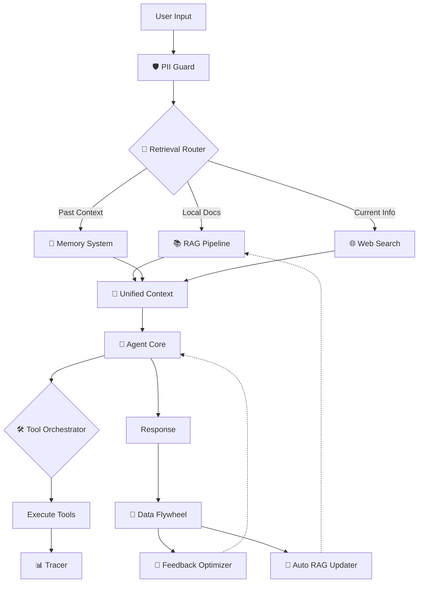
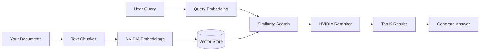
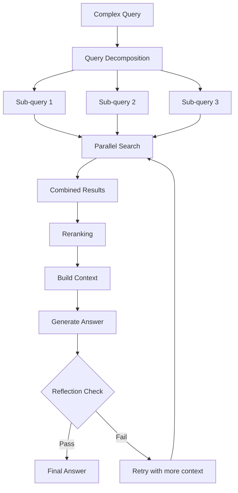
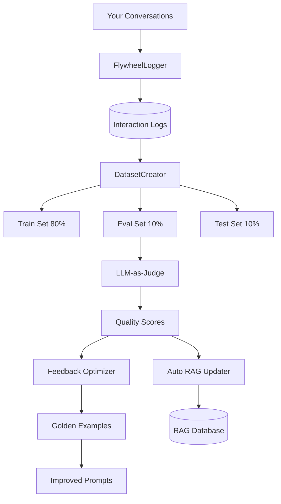
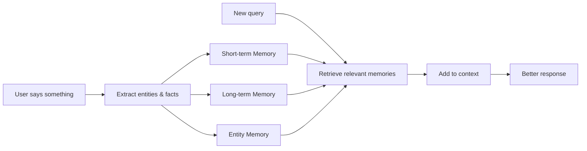

<p align="center">
  
</p>

<h1 align="center">Dory</h1>

<p align="center">
  <strong>Your co-worker with full system access, powered by NVIDIA NIM</strong>
</p>

<p align="center">
  <a href="#overview">Overview</a> •
  <a href="#quick-start">Quick Start</a> •
  <a href="#interface">Interface</a> •
  <a href="#modes">Modes</a> •
  <a href="#tools-24">Tools</a> •
  <a href="#settings">Settings</a> •
  <a href="#architecture">Architecture</a> •
  <a href="#rag-system">RAG</a> •
  <a href="#data-flywheel">Flywheel</a> •
  <a href="#memory-system">Memory</a> •
  <a href="#security">Security</a> •
  <a href="#models">Models</a> •
  <a href="#project-structure">Structure</a>
</p>

---

## Overview

Dory is a local-first AI co-worker that can read/write files, execute commands, search the web, and remember context across sessions. Built on NVIDIA NIM with a terminal-style interface.

**Not a chatbot.** Dory takes action - creates files, runs builds, searches documentation, analyzes repos.

### What Makes Dory Different

| Traditional Chatbot | Dory |
|---------------------|------|
| Only gives answers | Takes action on your system |
| Forgets everything | Remembers across sessions |
| No file access | Full filesystem access |
| No command execution | Runs any shell command |
| Generic responses | Learns from your codebase via RAG |

**Default Model:** Nemotron 3 Nano 30B (MoE) - 1M context window, 3.3x faster throughput

---

## Quick Start

```bash
# Clone and install
git clone https://github.com/caser-legal/nvidia-cli.git
cd nvidia-cli
npm install

# Add your API key
echo "NVIDIA_API_KEY=nvapi-xxx" > .env.local

# Run
npm run dev
```

### Shell Aliases (Recommended)

Add to `~/.zshrc`:
```bash
alias nv="cd /path/to/nvidia-cli && ./start.sh"
alias nvquit="pkill -f 'next dev'"
alias cv="cd /path/to/nvidia-cli && ./start.sh"
alias cvquit="pkill -f 'next dev'"
```

Then just type `nv` or `cv` to start.

Open [http://localhost:3000](http://localhost:3000)

---

## Interface

### Terminal-Style Design

The interface mimics a macOS terminal window with functional controls:

```
┌─────────────────────────────────────────────────────────────┐
│ 🔴 🟡 🟢  12/21/2024 2:05:23 PM          15 tok/s  238 tokens │
├─────────────────────────────────────────────────────────────┤
│                                                             │
│  [dory] Here's what's in your directory:                   │
│  - README.md                                                │
│  - package.json                                             │
│  - src/                                                     │
│                                                             │
├─────────────────────────────────────────────────────────────┤
│ ❯ Type your message here...                          [Send] │
└─────────────────────────────────────────────────────────────┘
```

### Traffic Light Buttons

| Button | Action |
|--------|--------|
| 🔴 Red | Delete current chat and start fresh |
| 🟡 Yellow | Minimize chat to sidebar, start new chat |
| 🟢 Green | Minimize chat to sidebar, start new chat |

### Header Metrics

| Metric | Description |
|--------|-------------|
| **Live Clock** | Current date and time, updates every second |
| **tok/s** | Tokens generated per second (speed indicator) |
| **tokens** | Total tokens used in current response |
| **elapsed** | Time since response started (shows Xm Ys when > 60s) |

### Input Area

- **Auto-expanding textarea**: Grows as you type (max 200px)
- **Gray border**: Shows input area bounds
- **Green border on focus**: Visual feedback when typing
- **Send/Stop button**: Shows "Send" when idle, "Stop" when running

### Keyboard Shortcuts

| Shortcut | Action |
|----------|--------|
| `Enter` | Send message |
| `Shift + Enter` | New line in input |
| `Ctrl + U` | Clear input |
| `⌘ ,` | Open Settings |

### Sidebar

- **NVIDIA Logo**: Click to start new chat
- **New Chat button**: Green button to start fresh
- **Session list**: All your conversations, click to resume
- **Trash icon**: Delete individual sessions (hover to reveal)
- **Settings**: Profile icon at bottom

---

## Modes

### 🐠 Dory (Default)

Full autonomy with all 24 tools. Handles any task:

- **Coding**: Read/write files, run builds, execute tests
- **Research**: Web search, analyze GitHub repos
- **File Operations**: Create, edit, delete files and directories
- **System Commands**: Run any shell command
- **Memory**: Remember context across sessions

**Best for:** 99% of tasks. Fast, autonomous, gets things done.

### 👥 Dory (Supervised)

Multi-agent research with quality review loops:

```
┌─────────────────────────────────────────────────────────────┐
│                    SUPERVISED MODE FLOW                     │
├─────────────────────────────────────────────────────────────┤
│                                                             │
│  User Query                                                 │
│      ↓                                                      │
│  🔍 Search Specialist (parallel web + local docs)          │
│      ↓                                                      │
│  📋 Report Planner (structured outline)                    │
│      ↓                                                      │
│  ✍️ Section Author (writes each section)                   │
│      ↓                                                      │
│  ✅ Quality Reviewer (evaluates completeness)              │
│      ↓                                                      │
│  🔄 Reflection Loop (max 3 rounds until approved)          │
│      ↓                                                      │
│  📚 Source Deduplicator (clean citations)                  │
│      ↓                                                      │
│  Final Report                                               │
│                                                             │
└─────────────────────────────────────────────────────────────┘
```

**Best for:** Complex research requiring thorough, reviewed results. Takes longer but more accurate.

---

## Tools (24)

Dory has 24 tools organized into 9 categories. Each tool is a capability that lets Dory interact with your system.

### Project Management

#### `set_project`
**File:** `lib/agents/tools/project.ts`

Sets the current working directory for all file and bash operations.

**How it works:** Updates a global variable that file_read, file_write, and bash tools use as their base path. Validates the directory exists before setting.

```typescript
set_project({ path: "/Users/home/Documents/MyApp" })
// Output: ✅ Project directory set to: /Users/home/Documents/MyApp
```

#### `get_project`
**File:** `lib/agents/tools/project.ts`

Returns the current working directory path.

**How it works:** Simply returns the global project directory variable. Useful for confirming which project you're working in.

```typescript
get_project()
// Output: Current project directory: /Users/home/Documents/MyApp
```

### File System

#### `file_read`
**File:** `lib/agents/tools/file-read.ts`

Reads file contents or lists directory contents.

**How it works:** Uses Node.js fs module to read files. Supports 'read' operation for file contents and 'list' operation for directory listings. Paths are resolved relative to the current project directory.

```typescript
// List directory
file_read({ operation: "list", path: "." })
// Output: 📄 README.md, 📁 src/, 📄 package.json

// Read file
file_read({ operation: "read", path: "README.md" })
// Output: [file contents]
```

#### `file_write`
**File:** `lib/agents/tools/file-write.ts`

Creates, overwrites, or edits files.

**How it works:** Uses Node.js fs module. 'write' operation creates/overwrites entire file. 'edit' operation does find-and-replace within existing file.

```typescript
// Create new file
file_write({ operation: "write", path: "hello.txt", content: "Hello World" })
// Output: Successfully wrote 11 characters to hello.txt

// Edit existing file
file_write({ operation: "edit", path: "config.json", old_text: '"debug": false', new_text: '"debug": true' })
// Output: Successfully edited config.json
```

### System

#### `bash`
**File:** `lib/agents/tools/bash.ts`

Executes shell commands on your system.

**How it works:** Uses Node.js child_process.exec() to run commands. Executes in the current project directory. Returns stdout/stderr output.

```typescript
bash({ command: "ls -la" })
bash({ command: "git status" })
bash({ command: "npm run build" })
bash({ command: "xcodebuild -scheme MyApp" })
```

**⚠️ Security Note:** This tool can run ANY command. The Tool Guard system can require confirmation for sensitive operations.

### Reasoning

#### `think`
**File:** `lib/agents/tools/think.ts`

Internal reasoning tool for complex problem solving.

**How it works:** Allows the agent to "think out loud" and break down complex problems into steps before taking action. The thought is logged but not shown to the user.

```typescript
think({ thought: "I need to first check if the file exists, then read its contents, then modify the specific function..." })
```

### Memory

#### `memory`
**File:** `lib/agents/tools/memory.ts`

Stores and retrieves information across conversations.

**How it works:** 
- **Short-term memory**: Session-based, stored in RAM, cleared when you close the browser
- **Long-term memory**: Persists to `~/.nvidia-cli/memory.json` file, survives restarts

```typescript
// Store something
memory({ operation: "store", key: "user_preference", value: "dark mode" })

// Retrieve it later (even in a new session)
memory({ operation: "retrieve", key: "user_preference" })
// Output: dark mode
```

#### `entity_memory`
**File:** `lib/agents/tools/memory.ts`

Tracks entities like people, projects, companies, and technologies.

**How it works:** Specialized memory that categorizes and links related entities. Helps maintain context about things you frequently discuss.

```typescript
entity_memory({ 
  operation: "add", 
  type: "project", 
  name: "MyApp", 
  details: "iOS app using SwiftUI, targeting iOS 17+" 
})

// Later, Dory can recall:
// "MyApp is an iOS app using SwiftUI, targeting iOS 17+"
```

### Search

#### `google_search`
**File:** `lib/agents/tools/google-search.ts`

Searches Google for information.

**How it works:** Uses Google Custom Search API. Returns top search results with titles, snippets, and URLs.

**Requires:** `GOOGLE_API_KEY` and `GOOGLE_CSE_ID` in environment.

```typescript
google_search({ query: "Swift async await tutorial" })
```

#### `tavily_search`
**File:** `lib/agents/tools/tavily-search.ts`

AI-optimized web search with full content extraction.

**How it works:** Uses Tavily API designed for AI assistants. Returns more detailed content than Google, including full page text extraction. Better for research tasks.

**Requires:** `TAVILY_API_KEY` in environment.

```typescript
tavily_search({ query: "iOS 18 new features", topic: "general" })
```

#### `parallel_search`
**File:** `lib/agents/tools/parallel-search.ts`

Runs multiple Google searches simultaneously.

**How it works:** Takes an array of queries and executes them in parallel using Promise.all(). Faster than sequential searches for multi-topic research.

```typescript
parallel_search({ queries: ["SwiftUI tutorials", "UIKit migration", "Combine framework"] })
```

#### `parallel_tavily_search`
**File:** `lib/agents/tools/tavily-search.ts`

Runs multiple Tavily searches simultaneously.

**How it works:** Same as parallel_search but uses Tavily API for deeper content extraction.

```typescript
parallel_tavily_search({ queries: ["React hooks best practices", "Vue composition API guide"] })
```

#### `local_docs_search`
**File:** `lib/agents/tools/local-docs-search.ts`

Searches local documentation files.

**How it works:** Scans markdown and text files in your project for keyword matches. Useful for finding information in your own docs without web search.

```typescript
local_docs_search({ query: "authentication" })
```

### Code

#### `github_analyzer`
**File:** `lib/agents/tools/github-analyzer.ts`

Clones and analyzes GitHub repositories.

**How it works:** Clones repo to temp directory, analyzes file structure, identifies languages, counts lines of code, and extracts key information.

```typescript
github_analyzer({ operation: "analyze", repo_url: "https://github.com/apple/swift" })
// Output: Languages, file count, structure overview, key files
```

#### `github_file_reader`
**File:** `lib/agents/tools/github-analyzer.ts`

Reads specific files from cloned GitHub repos.

**How it works:** After github_analyzer clones a repo, this tool reads individual files from the cloned copy.

```typescript
github_file_reader({ repo: "apple/swift", path: "README.md" })
```

#### `code_documentation`
**File:** `lib/agents/tools/code-documentation.ts`

Generates documentation for codebases.

**How it works:** Analyzes code structure and generates README, API docs, or architecture documentation using the LLM.

```typescript
code_documentation({ type: "readme", path: "." })
code_documentation({ type: "api", path: "./src" })
```

### Diagrams

#### `mermaid_generator`
**File:** `lib/agents/tools/mermaid-generator.ts`

Creates Mermaid diagrams for architecture visualization.

**How it works:** Mermaid is a text-based diagramming language. This tool generates flowcharts, sequence diagrams, class diagrams, and architecture diagrams from descriptions.

```typescript
mermaid_generator({ type: "flowchart", description: "User login flow with OAuth" })
// Output: Mermaid code that renders as a diagram
```

#### `quick_diagram`
**File:** `lib/agents/tools/mermaid-generator.ts`

Fast diagram generation using templates.

**How it works:** Pre-built templates for common diagram types. Faster than mermaid_generator for standard patterns.

```typescript
quick_diagram({ template: "api_flow" })
quick_diagram({ template: "database_schema" })
```

### RAG (Retrieval-Augmented Generation)

RAG lets Dory search and learn from your own documents. Think of it as giving Dory a filing cabinet of your stuff to reference.

#### `rag_ingest`
**File:** `lib/agents/tools/rag-tools.ts`

Adds documents to the knowledge base.

**How it works:** 
1. Reads your documents (markdown, text, code files)
2. Splits them into chunks (~500 tokens each)
3. Converts chunks to embeddings (numerical representations) using NVIDIA's embedding model
4. Stores embeddings in a vector database for semantic search

```typescript
rag_ingest({ path: "./docs" })
// Output: Ingested 47 documents, 312 chunks
```

#### `rag_search`
**File:** `lib/agents/tools/rag-tools.ts`

Searches ingested documents using semantic similarity.

**How it works:** Converts your query to an embedding and finds documents with similar meaning, not just keyword matches. Uses cosine similarity to rank results.

```typescript
rag_search({ query: "how to authenticate users" })
// Returns: Top 5 most relevant document chunks
```

#### `rag_query`
**File:** `lib/agents/tools/rag-tools.ts`

Asks questions about ingested documents.

**How it works:** Combines rag_search with LLM to answer questions:
1. Searches for relevant document chunks
2. Passes chunks as context to the LLM
3. LLM generates answer based on your documents

```typescript
rag_query({ question: "What authentication methods does our API support?" })
// Output: Based on your docs, the API supports OAuth2, API keys, and JWT...
```

#### `rag_research`
**File:** `lib/agents/tools/rag-tools.ts`

Deep research using RAG with query decomposition.

**How it works:** Based on NVIDIA AIQ Research Assistant pattern:
1. Breaks complex question into sub-questions
2. Searches for each sub-question
3. Synthesizes comprehensive answer
4. Reflects on answer quality

```typescript
rag_research({ topic: "Compare our REST API vs GraphQL implementation" })
```

#### `rag_stats`
**File:** `lib/agents/tools/rag-tools.ts`

Shows statistics about the RAG database.

```typescript
rag_stats()
// Output: 47 documents, 312 chunks, 2.3MB storage
```

#### `rag_clear`
**File:** `lib/agents/tools/rag-tools.ts`

Clears all documents from the RAG database.

```typescript
rag_clear()
// Output: Cleared all documents from RAG
```

---

## Settings

Full settings page at `/settings` (or press `⌘ ,`).

### Appearance

#### Theme
- **Light**: White background, dark text
- **Dark**: Dark background, light text  
- **System**: Automatically matches your OS preference

**How it works:** Uses `next-themes` library. Adds `dark` class to HTML element which Tailwind CSS uses for dark mode styles.

#### Font Size
- **Small**: 12px (compact, more content visible)
- **Medium**: 14px (default, balanced)
- **Large**: 16px (easier to read)

**How it works:** Applies Tailwind classes (`text-xs`, `text-sm`, `text-base`) to the chat output area.

#### Code Theme
- **One Dark**: Dark theme popular in VS Code
- **GitHub**: Light theme matching GitHub's style
- **Dracula**: Purple-tinted dark theme

**How it works:** Uses `react-syntax-highlighter` library with Prism themes. Applied to all code blocks in responses.

### API Configuration

#### NVIDIA API Key
Your key for accessing NVIDIA NIM models.

**How it works:** 
- Reads from `.env.local` file on page load
- Saves directly to `.env.local` when you click Save
- Server restart required after changing

**Get your key:** [build.nvidia.com](https://build.nvidia.com) (free tier available)

#### Model Info
Shows current model details:
- **NIM** (NVIDIA Inference Microservices): NVIDIA's cloud API for running language models
- **MoE** (Mixture of Experts): Architecture where only some "expert" networks activate per request, making it faster
- **Context Window**: How much text the model can "see" at once (128K tokens ≈ 100,000 words)

### Usage Statistics

#### Total Tokens
Count of all input and output tokens used since reset date.

**What are tokens?** Tokens are pieces of text, roughly 4 characters or ¾ of a word. "Hello world" = 2 tokens.

#### Conversations
Number of chat sessions started since reset date.

#### Activity Log
Terminal-style log showing last 60 sessions with:
- Timestamp
- Status indicator (● running, ✓ completed)
- Session name

#### Reset Button
Clears statistics and sets new "since" date.

### Available Tools

Expandable documentation for all 24 tools showing:
- **Description**: What the tool does
- **How it works**: Technical explanation
- **Example**: Sample usage

### Keyboard Shortcuts Reference

| Shortcut | Action |
|----------|--------|
| `⌘ ,` | Open Settings |
| `Enter` | Send message |
| `Shift + Enter` | New line in input |
| `Ctrl + U` | Clear input |

### About Dory

Beginner-friendly explanations:

#### What is Dory?
Dory is your co-worker that lives in your computer. You type what you need, and Dory does it — whether that's writing code, searching the internet, reading your files, or running commands.

#### How does it work?
When you send a message:
1. Goes to NVIDIA's servers
2. Language model figures out what you need
3. Dory uses tools to take action
4. Results come back to you

#### What are "Tools"?
Tools are Dory's hands. Without tools, Dory could only talk. With tools, Dory can actually do things: create files, run programs, search the web, remember things.

#### What are "Tokens"?
Tokens measure text. 1 token ≈ 4 characters ≈ ¾ word. The model handles ~128,000 tokens at once (roughly a 200-page book).

#### What is "RAG"?
RAG = Retrieval-Augmented Generation. It means Dory can search your documents before answering. Like giving Dory a filing cabinet of your stuff.

#### What is "Context"?
Context is Dory's short-term memory for the current conversation. Everything said stays in context so Dory remembers what you're working on. When full (100%), older messages get forgotten.

#### What is "Memory"?
Memory persists across conversations — saved to a file. Context is temporary; memory is permanent.

#### Is my data private?
- Conversations sent to NVIDIA for processing
- Files, memory, history stored locally on your machine
- Tools run on your machine
- NVIDIA doesn't store conversations permanently

#### What are the modes?
- **Dory**: Full access, decides which tools to use. Default for 99% of tasks.
- **Dory (Supervised)**: Multiple specialists check each other's work. Slower but more thorough.

---

## Architecture

### System Overview



### Intelligence Layer

#### Retrieval Router
**File:** `lib/agents/retrieval-router.ts`

Decides where to get information for each query:
- **RAG**: For questions about your ingested documents
- **Web Search**: For current events, external information
- **Memory**: For things you've told Dory before

**How it works:** Uses the LLM to classify the query and route to the appropriate source.

#### Tool Orchestrator
**File:** `lib/agents/tool-orchestrator.ts`

Dynamically selects which tools to use for a task.

**How it works:** Analyzes the user's request and pre-selects relevant tools before the main agent loop, improving efficiency.

### Learning Layer

#### Feedback Optimizer
**File:** `lib/agents/feedback-optimizer.ts`

Learns from failures to improve future responses.

**How it works:**
1. Monitors failed interactions (errors, low quality scores)
2. Analyzes what went wrong
3. Generates "Golden Examples" - ideal responses for similar queries
4. Uses these examples to improve future prompts

#### Auto RAG Updater
**File:** `lib/agents/rag/auto-updater.ts`

Automatically ingests high-quality interactions into RAG.

**How it works:**
1. Monitors Flywheel for successful interactions
2. Identifies responses with high quality scores
3. Adds them to the RAG database
4. Future queries can reference past successful answers

### Unified Context
**File:** `lib/agents/unified-context.ts`

Bridges all context sources into a single interface for the agent.

**Components:**
- RAG Pipeline (document search)
- Short-term Memory (current session)
- Long-term Memory (persistent)
- Flywheel History (past interactions)
- Entity Memory (people, projects, etc.)

---

## RAG System

Full RAG pipeline based on NVIDIA RAG Blueprint.

### Architecture



### Components

| Component | Model/File | Description |
|-----------|------------|-------------|
| **Embeddings** | `nvidia/llama-3.2-nv-embedqa-1b-v2` | Converts text to 2048-dimension vectors |
| **Reranker** | `nvidia/llama-3.2-nv-rerankqa-1b-v2` | Re-scores results for relevance |
| **Vector Store** | `lib/agents/rag/embeddings.ts` | In-memory store with cosine similarity |
| **Query Decomposition** | `lib/agents/rag/query-decomposition.ts` | Breaks complex queries into sub-queries |
| **Reflection** | `lib/agents/rag/reflection.ts` | Checks context relevance and groundedness |

### RAG Pipeline Flow



### Implementation Files

```
lib/agents/rag/
├── types.ts              # Document, SearchResult, WorkflowState types
├── embeddings.ts         # NVIDIAEmbeddings, NVIDIAReranker, SimpleVectorStore
├── query-decomposition.ts # QueryDecomposer for complex queries
├── reflection.ts         # ReflectionSystem, ReflectionCounter
├── research-workflow.ts  # Full AIQ-style research workflow
├── pipeline.ts           # Unified RAGPipeline class
└── auto-updater.ts       # Syncs Flywheel data to RAG
```

---

## Data Flywheel

Production data logging system based on NVIDIA Data Flywheel Blueprint.

### Purpose

The Data Flywheel captures every interaction so you can:
1. **Debug**: See exactly what happened in each conversation
2. **Evaluate**: Score response quality with LLM-as-Judge
3. **Improve**: Use feedback to tune prompts and behavior
4. **Train**: Create datasets for fine-tuning (future)

### Architecture



### Components

| Component | File | Description |
|-----------|------|-------------|
| **FlywheelLogger** | `lib/agents/flywheel/logger.ts` | Captures all interactions with timing |
| **DatasetCreator** | `lib/agents/flywheel/dataset.ts` | Creates train/eval/test splits |
| **FlywheelEvaluator** | `lib/agents/flywheel/evaluator.ts` | LLM-as-Judge quality scoring |
| **FeedbackOptimizer** | `lib/agents/feedback-optimizer.ts` | Generates Golden Examples from failures |

### What Gets Logged

Each interaction captures:
- Timestamp
- User query
- Agent response
- Tools called and their results
- Token counts
- Latency
- Quality score (if evaluated)

---

## Memory System

### Types of Memory

| Type | Persistence | Storage | Use Case |
|------|-------------|---------|----------|
| **Context** | Current session only | In-memory | Current conversation |
| **Short-term** | Session only | In-memory | Working memory during tasks |
| **Long-term** | Permanent | `~/.nvidia-cli/memory.json` | Facts to remember forever |
| **Entity** | Permanent | `~/.nvidia-cli/memory.json` | People, projects, companies |

### Memory Flow



### Implementation

**File:** `lib/agents/tools/memory.ts`

```typescript
// Short-term (session only)
class ShortTermMemory {
  private store: Map<string, string>;
  // Cleared when browser closes
}

// Long-term (persistent)
class LongTermMemory {
  private filePath = "~/.nvidia-cli/memory.json";
  // Survives restarts
}

// Entity tracking
class EntityMemoryTool {
  // Tracks: people, projects, companies, technologies
  // Links related entities together
}
```

---

## Security

### PII Guard
**File:** `lib/security/pii-guard.ts`

Automatically redacts sensitive information from logs and tool inputs.

| Pattern | Replacement |
|---------|-------------|
| `user@email.com` | `[EMAIL_REDACTED]` |
| `555-123-4567` | `[PHONE_REDACTED]` |
| `nvapi-xxx...` | `[API_KEY_REDACTED]` |
| `192.168.1.1` | `[IP_REDACTED]` |
| `4111-1111-1111-1111` | `[CARD_REDACTED]` |

### Tool Guard
**File:** `lib/security/tool-guard.ts`

Permission system for tool execution.

| Category | Tools | Default |
|----------|-------|---------|
| **Safe** | google_search, memory, think | Auto-allowed |
| **Sensitive** | bash, file_write | Requires confirmation* |
| **Dangerous** | (none currently) | Always blocked |

*In prototype mode, confirmation is auto-granted. Production mode would prompt user.

### Tracer
**File:** `lib/agents/observability/tracer.ts`

Distributed tracing for debugging and monitoring.

**Tracks:**
- Agent run start/end
- Each tool call with timing
- LLM API calls
- Errors and retries

**Access traces:**
```typescript
import { globalTracer } from "@/lib/agents/observability/tracer";
const trace = globalTracer.getTrace();
```

---

## Models

| Model | Context | Parameters | Best For |
|-------|---------|------------|----------|
| **Nemotron 3 Nano 30B** (default) | 1M tokens | 30B (3.5B active) | Fast reasoning, general tasks |
| Nemotron Super 49B | 128K | 49B | Agentic coding |
| Nemotron Ultra 253B | 128K | 253B | Maximum capability |
| Llama 3.3 70B | 128K | 70B | General purpose |

### Why Nemotron 3 Nano?

- **MoE Architecture**: Only 3.5B parameters activate per token (out of 30B total)
- **3.3x faster** than dense models of similar quality
- **1M context window**: Can "see" ~750,000 words at once
- **Cost effective**: Lower compute = lower API costs

---

## Environment Variables

```env
# Required
NVIDIA_API_KEY=nvapi-xxx          # Get from build.nvidia.com

# Optional - for web search
TAVILY_API_KEY=tvly-xxx           # Tavily search (recommended)
GOOGLE_API_KEY=xxx                # Google Custom Search
GOOGLE_CSE_ID=xxx                 # Google Custom Search Engine ID
```

---

## Project Structure

```
nvidia-cli/
├── app/                          # Next.js App Router
│   ├── page.tsx                  # Main chat interface
│   ├── settings/page.tsx         # Settings page
│   ├── layout.tsx                # Root layout with theme provider
│   └── api/
│       ├── agent-chat/route.ts   # Main agent endpoint
│       └── settings/api-key/     # API key management
│
├── components/
│   ├── agents/
│   │   └── agent-chat.tsx        # Terminal-style chat UI
│   ├── sidebar/
│   │   └── sidebar.tsx           # Session list, navigation
│   ├── layout/
│   │   └── header.tsx            # Top bar with model selector
│   ├── settings/
│   │   └── settings-modal.tsx    # Settings components
│   └── ui/                       # Shadcn UI components
│
├── lib/
│   ├── agents/
│   │   ├── agent.ts              # Core agent loop
│   │   ├── types.ts              # TypeScript interfaces
│   │   ├── unified-context.ts    # Context aggregation
│   │   ├── retrieval-router.ts   # Query routing
│   │   ├── tool-orchestrator.ts  # Tool selection
│   │   ├── feedback-optimizer.ts # Learning from failures
│   │   │
│   │   ├── tools/                # 24 tool implementations
│   │   │   ├── project.ts        # set_project, get_project
│   │   │   ├── file-read.ts      # file_read
│   │   │   ├── file-write.ts     # file_write
│   │   │   ├── bash.ts           # bash
│   │   │   ├── think.ts          # think
│   │   │   ├── memory.ts         # memory, entity_memory
│   │   │   ├── google-search.ts  # google_search
│   │   │   ├── tavily-search.ts  # tavily_search, parallel_tavily
│   │   │   ├── parallel-search.ts# parallel_search
│   │   │   ├── local-docs-search.ts
│   │   │   ├── github-analyzer.ts# github_analyzer, github_file_reader
│   │   │   ├── code-documentation.ts
│   │   │   ├── mermaid-generator.ts
│   │   │   └── rag-tools.ts      # All RAG tools
│   │   │
│   │   ├── rag/                  # RAG system
│   │   │   ├── pipeline.ts       # Main RAGPipeline class
│   │   │   ├── embeddings.ts     # NVIDIA embeddings & reranker
│   │   │   ├── query-decomposition.ts
│   │   │   ├── reflection.ts     # Quality checking
│   │   │   ├── research-workflow.ts
│   │   │   └── auto-updater.ts   # Flywheel → RAG sync
│   │   │
│   │   ├── flywheel/             # Data logging
│   │   │   ├── logger.ts         # FlywheelLogger
│   │   │   ├── dataset.ts        # DatasetCreator
│   │   │   └── evaluator.ts      # LLM-as-Judge
│   │   │
│   │   └── observability/
│   │       └── tracer.ts         # Distributed tracing
│   │
│   ├── store/                    # Zustand state management
│   │   ├── index.ts              # UI store, settings
│   │   ├── conversations.ts      # Chat history
│   │   └── agent-sessions.ts     # Session management
│   │
│   └── security/
│       ├── pii-guard.ts          # PII redaction
│       └── tool-guard.ts         # Permission system
│
├── public/
│   ├── nvidia-logo.webp          # Logo
│   └── avatar.png                # User avatar
│
├── start.sh                      # Startup script
└── package.json
```

---

## NeMo Agent Toolkit (Optional)

For production-grade infrastructure, integrate with NVIDIA NeMo Agent Toolkit.

### Setup

```bash
./bin/setup-nat
./bin/start-all
```

### Features

| Feature | Description |
|---------|-------------|
| **Phoenix Observability** | Real-time tracing UI |
| **MCP Server** | Expose tools via Model Context Protocol |
| **Profiling** | Token-level performance analysis |
| **Evaluation** | `nat eval` for batch quality scoring |

### NAT Commands

```bash
nat serve --config_file nat/configs/dory_workflow.yml  # Start server
nat run --input "Your query"                            # Single query
nat eval --config_file nat/configs/eval_config.yml     # Run evaluation
nat mcp --config_file nat/configs/mcp_server.yml       # MCP server
```

---

## License

MIT

---

<p align="center">
  Built with <a href="https://nextjs.org">Next.js</a> and <a href="https://build.nvidia.com">NVIDIA NIM</a>
</p>
