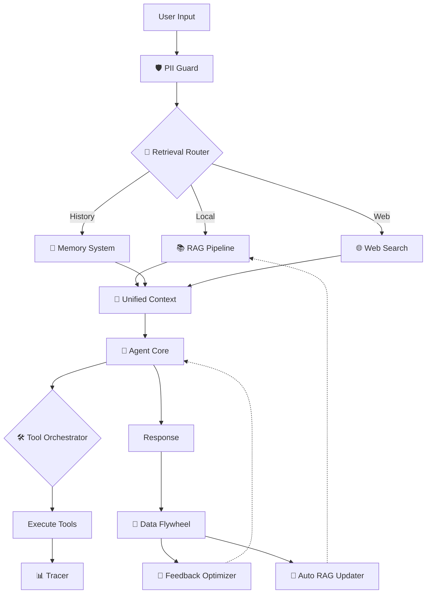
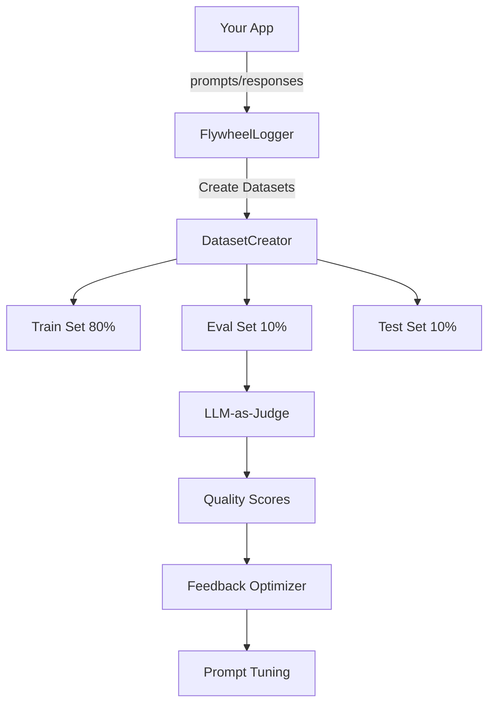

<p align="center">
  
  </p>

  </p>
</p>

<h1 align="center">NVIDIA CLI</h1>

<p align="center">
  <strong>A powerful, privacy-first AI assistant powered by NVIDIA NIM</strong>
    -<a href="http://localhost:3000/">Local 3000</a> or <a href="http://localhost:3001/">Local 3001</a>
</p>

<p align="center">
  <a href="#features">Features</a> •
  <a href="#modes">Modes</a> •
  <a href="#architecture">Architecture</a> •
  <a href="#rag-system">RAG</a> •
  <a href="#data-flywheel">Flywheel</a> •
  <a href="#security--observability">Security</a> •
  <a href="#cli-usage">CLI Usage</a> •
  <a href="#getting-started">Setup</a>
</p>

---

## Overview

NVIDIA CLI [codename: **dory**] is a full-featured AI application implementing patterns from official NVIDIA AI Blueprints. It goes beyond simple chat by integrating RAG, Memory, and Learning loops into a cohesive **Unified Context Layer**.

- **RAG Blueprint** - NVIDIA embeddings, reranking, query decomposition, reflection
- **Data Flywheel Blueprint** - Production logging, LLM-as-Judge, feedback loops
- **AIQ Research Assistant** - Multi-step research with reflection loops
- **Agent Workshop** - LangGraph-style state machines, ReAct pattern

**Default Model:** Nemotron 3 Nano 30B - 1M context, 3.3x faster throughput

---

## Features

| Category | Features |
|----------|----------|
| **🧠 Intelligence** | **Retrieval Router** (RAG vs Web vs Memory), **Tool Orchestrator** (Dynamic selection) |
| **🔄 Learning** | **Feedback Optimizer** (Self-correction), **Auto RAG Updater** (Ingests resolved queries) |
| **📚 Unified Context** | Bridges RAG, Short/Long-term Memory, and Flywheel history |
| **🛡️ Security** | **PII Guard** (Redaction), **Tool Guard** (Permission checks), **Tracer** (Observability) |
| **🔍 RAG System** | NVIDIA embeddings + reranking, query decomposition, reflection |
| **📊 Data Flywheel** | Interaction logging, dataset creation, LLM-as-Judge evaluation |
| **🤖 Multi-Agent** | 8 specialist agents, quality scoring, reflection loops |
| **🛠️ Tools** | File ops, bash, Tavily/Google search, GitHub analyzer, Mermaid diagrams |

---

## Architecture

The system is built on a **Unified Context Layer** that feeds the Agent:



---

## Modes

| Mode | Description | Key Tools |
|------|-------------|-----------|
| **🤖 Auto** (Default) | Intelligent orchestrator | Dynamic selection from ALL tools |
| **💬 Chat** | General assistant | Memory, entity tracking |
| **💻 Coder** | Autonomous coding | GitHub analyzer, Mermaid diagrams |
| **📄 Docs** | Documentation generator | Code documentation, architecture diagrams |
| **🖥️ Controller** | Computer automation | Bash, file operations |
| **🌐 Browser** | Web browsing | Tavily, Google search |
| **🔬 Research** | Deep research | Parallel search, RAG |
| **👥 Coordinator** | Multi-agent research | All specialist agents |

---

## RAG System

Full RAG pipeline based on NVIDIA RAG Blueprint with embeddings, reranking, and reflection.

### Components

| Component | Model/Description |
|-----------|-------------------|
| **Embeddings** | `nvidia/llama-3.2-nv-embedqa-1b-v2` - 2048 dimensions |
| **Reranker** | `nvidia/llama-3.2-nv-rerankqa-1b-v2` - Relevance scoring |
| **Query Decomposition** | Breaks complex queries into sub-queries |
| **Reflection** | Context relevance + response groundedness checking |
| **Auto Updater** | Automatically ingests high-quality Flywheel interactions |

### Implementation Files

```
lib/agents/rag/
├── types.ts              # Document, SearchResult, WorkflowState types
├── embeddings.ts         # NVIDIAEmbeddings, NVIDIAReranker, SimpleVectorStore
├── query-decomposition.ts # QueryDecomposer for complex queries
├── reflection.ts         # ReflectionSystem, ReflectionCounter
├── research-workflow.ts  # Full AIQ-style research workflow
├── pipeline.ts           # Unified RAGPipeline
└── auto-updater.ts       # Syncs Flywheel data to RAG
```

---

## Data Flywheel

Production data logging system based on NVIDIA Data Flywheel Blueprint.

### Architecture



### Components

| Component | Description |
|-----------|-------------|
| **FlywheelLogger** | Captures all interactions + timing |
| **FeedbackOptimizer** | Analyzes failures to generate "Golden Examples" |
| **DatasetCreator** | Creates train/eval/test splits |
| **FlywheelEvaluator** | LLM-as-Judge quality scoring |

---

## Security & Observability

Enterprise-grade features integrated into the core agent.

### 🛡️ PII Guard
Automatically redacts sensitive information from logs and tool inputs:
- Emails -> `[EMAIL_REDACTED]`
- Phone Numbers -> `[PHONE_REDACTED]`
- API Keys -> `[API_KEY_REDACTED]`
- IP Addresses -> `[IP_REDACTED]`

### 🔒 Tool Guard
Permission system for tool execution:
- **Safe Tools** (Google, Memory): Allowed automatically
- **Sensitive Tools** (Bash, File Write): Require explicit confirmation (configurable)

### 📊 Tracer
Distributed tracing for every action:
- Tracks Agent Run -> Tool Selection -> Tool Execution -> Result
- Logs latency, success/failure, and attributes
- Available via `globalTracer.getTrace()`

---

## CLI Usage

Run the agent directly from your terminal using the Node.js wrapper.

```bash
# Make executable (first time only)
chmod +x bin/dory

# Run in Auto Mode (Default) - Intelligently picks tools for any task
./bin/dory "Explain quantum computing"

# Run in specific modes (optional)
./bin/dory "Latest breakthroughs in fusion energy" --mode research
./bin/dory "Create a React component for a login form" --mode coder
```

---

## Memory System

Persistent memory across sessions.

| Component | Description |
|-----------|-------------|
| **ShortTermMemory** | Session-based, in-memory storage |
| **LongTermMemory** | File-persisted at `~/.nvidia-cli/memory.json` |
| **EntityMemory** | Tracks people, projects, companies, technologies |

---

## GitHub Analyzer

Clone and analyze public repositories.

```typescript
github_analyzer({ operation: "analyze", repo_url: "..." })
```

---

## Models

| Model | Context | Best For |
|-------|---------|----------|
| **Nemotron 3 Nano 30B** (default) | 1M | Fast reasoning, 3.3x throughput |
| **Nemotron Super 49B** | 128K | Agentic coding tasks |
| **Nemotron Ultra 253B** | 128K | Maximum capability |
| **Llama 3.3 70B** | 128K | General purpose |

---

## Getting Started

### Prerequisites
- Node.js 18+
- NVIDIA API Key ([Get one free](https://build.nvidia.com))

### Installation

```bash
git clone https://github.com/caser-legal/nvidia-cli.git
cd nvidia-cli
npm install
cp .env.example .env.local
# Add your NVIDIA_API_KEY to .env.local
npm run dev
```

Open [http://localhost:3000](http://localhost:3000)

### Environment Variables

```env
NVIDIA_API_KEY=nvapi-xxx          # Required
TAVILY_API_KEY=tvly-xxx           # Optional: For Tavily search
GOOGLE_API_KEY=xxx                # Optional: For Google search
GOOGLE_CSE_ID=xxx                 # Optional: For Google search
```

---

## Project Structure

```
nvidia-cli/
├── app/                 # Next.js App Router
├── bin/                 # CLI entry point (dory)
├── components/          # UI Components
├── lib/
│   ├── agents/
│   │   ├── agent.ts             # Core Agent with Guards & Tracing
│   │   ├── unified-context.ts   # RAG + Memory + Flywheel Bridge
│   │   ├── retrieval-router.ts  # Intelligence Layer
│   │   ├── tool-orchestrator.ts # Intelligence Layer
│   │   ├── feedback-optimizer.ts# Learning Layer
│   │   ├── rag/                 # RAG System
│   │   │   ├── auto-updater.ts  # RAG Learning Loop
│   │   │   └── ...
│   │   ├── flywheel/            # Data Flywheel
│   │   ├── observability/       # Tracing
│   │   └── tools/               # Tool Definitions
│   └── security/                # PII & Tool Guards
└── public/
```

---

## License

MIT

---

<p align="center">
  Built with ❤️ using <a href="https://nextjs.org">Next.js</a> and <a href="https://build.nvidia.com">NVIDIA NIM</a>
</p>
