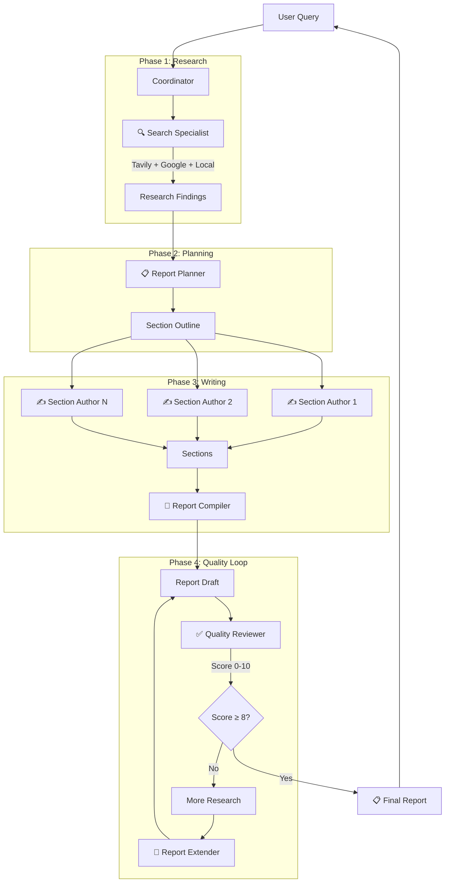
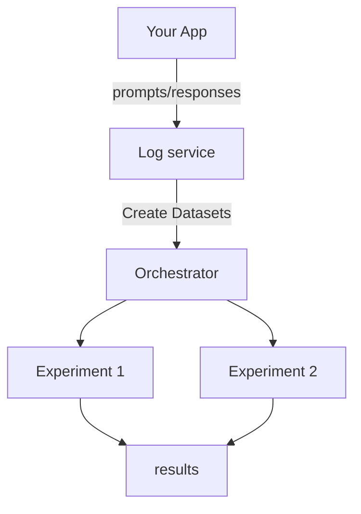
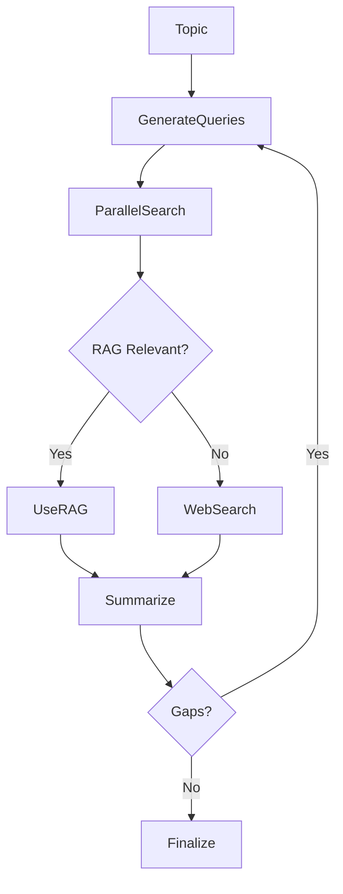
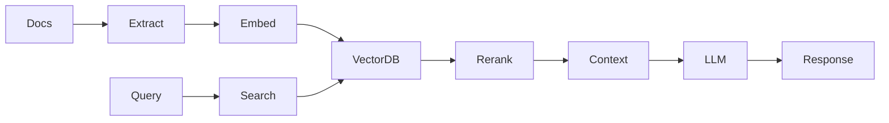
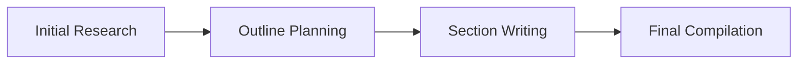

<p align="center">
  
</p>

<h1 align="center">NVIDIA CLI</h1>

<p align="center">
  <strong>A powerful, privacy-first AI assistant powered by NVIDIA NIM</strong>
</p>

<p align="center">
  <a href="#features">Features</a> •
  <a href="#modes">Modes</a> •
  <a href="#multi-agent-coordinator">Multi-Agent</a> •
  <a href="#models">Models</a> •
  <a href="#getting-started">Getting Started</a> •
  <a href="#nvidia-blueprints-reference">Blueprints</a>
</p>

---

## Overview

NVIDIA CLI [codename: **dory**] is a full-featured application powered by NVIDIA's NIM (NVIDIA Inference Microservices) API. It provides a terminal-like interface with multiple agent modes, real tool execution, multi-agent coordination with reflection loops, and multi-model support.

**Default Model:** Nemotron 3 Nano 30B - 1M context, 3.3x faster throughput, optimized for reasoning

---

## Features

### 🎯 Core Chat
- **Multi-model support** - 10+ NVIDIA NIM models
- **Streaming responses** - Real-time token streaming with metrics (tok/s, total tokens, elapsed time)
- **Markdown rendering** - Full GFM support with syntax highlighting
- **Conversation management** - Create, rename, pin, archive, search
- **Conversation memory** - Maintains context across messages in session

### 🔍 Search Tools
- **Tavily Search** - AI-optimized search with full content extraction (primary)
- **Google Search** - FREE Google Custom Search API (fallback)
- **Parallel Search** - Multiple queries executed concurrently
- **Local Docs Search** - Search dev-docs before falling back to web

### 🤖 Real Tool Execution
- **File operations** - Read, write, list directories
- **Shell commands** - Execute bash commands
- **Thinking** - Internal reasoning for complex problems

### 🔄 Multi-Agent Coordinator
- **8 Specialist Agents** - Search, Planner, Section Author, Writer, Reviewer, Extender, Compiler, Deduplicator
- **Two Workflow Options** - Quick Report or Structured Report with planning
- **Reflection Loop** - Iterates until quality score ≥ 8/10
- **Quality Scoring** - Completeness, Accuracy, Clarity, Citations, Depth (0-10 each)

### 🎨 Artifacts
- **Code blocks** - Syntax highlighted with 50+ languages
- **HTML/CSS** - Live preview with sandboxed iframe
- **React components** - Live rendering
- **Mermaid diagrams** - Flowcharts, sequence diagrams

### ⚙️ Advanced
- **Command palette** - Quick actions (Cmd+K)
- **Keyboard shortcuts** - Full keyboard navigation
- **Stop button** - Abort running agents at any time

---

## Modes

Switch modes from the header dropdown or input mode selector.

### 💬 Dory (Chat)
General-purpose assistant with full CLI file and command access.
- **Memory System** - Remembers facts, decisions, and entities across sessions
- **Entity Tracking** - Automatically tracks people, projects, companies mentioned

### 💻 Coder Mode
**Autonomous coding agent** - Build entire apps from start to finish.
- **GitHub Analyzer** - Clone and analyze any public repository
- **Mermaid Diagrams** - Auto-generate architecture diagrams
- **Memory** - Remembers project context

**iOS Development Support:**
- Build: `xcodebuild -project *.xcodeproj -scheme * -destination 'generic/platform=iOS'`
- Codesign fix: `xattr -cr .` to strip extended attributes
- Team ID: 672RKF28YZ, Bundle prefix: caserlegal.[AppName]

### 📄 Docs Mode (NEW)
**Code documentation generator** - Analyze codebases and generate comprehensive docs.
- **GitHub Analyzer** - Clone and analyze any public repo
- **README Generator** - Comprehensive project documentation
- **Architecture Docs** - System design with mermaid diagrams
- **API Documentation** - Endpoint references

```
[you] Document https://github.com/owner/repo
⚡ github_analyzer({"operation": "analyze", "repo_url": "..."})
⚡ code_documentation({"operation": "full", "repo_url": "..."})
⚡ mermaid_generator({"diagram_type": "flowchart", ...})
[dory] Generated README.md, ARCHITECTURE.md, API.md with diagrams
```

### 🖥️ Controller Mode
Computer automation - open apps, run scripts, system commands.

### 🌐 Browser Mode
Web browsing with Tavily (deep content) and Google (quick lookups).

### 🔬 Research Mode
Deep research with all search tools: Tavily, Google, parallel search, local docs.
- **Memory** - Stores key findings for later recall

### 👥 Coordinator Mode (Multi-Agent)
**Full multi-agent research system.** See [Multi-Agent Coordinator](#multi-agent-coordinator) below.

---

## Multi-Agent Coordinator

The Coordinator mode orchestrates a team of specialist agents for comprehensive research with quality assurance.

### Architecture



### Specialist Agents

| Agent | Role | Tools |
|-------|------|-------|
| **Search Specialist** | Comprehensive research | `parallel_tavily_search`, `parallel_search`, `local_docs_search` |
| **Report Planner** | Creates structured outline | None (pure planning) |
| **Section Author** | Writes individual sections | None (pure writing) |
| **Report Writer** | Quick full reports | None (pure writing) |
| **Quality Reviewer** | Evaluates completeness | None (pure evaluation) |
| **Report Extender** | Integrates new findings | None (pure editing) |
| **Report Compiler** | Assembles final report | None (utility) |
| **Source Deduplicator** | Cleans citations | None (utility) |

### Workflow Options

#### Option A: Quick Report (Simple Topics)
```
Search → Write → Review → [If approved] Deliver
```

#### Option B: Structured Report (Complex Topics) - RECOMMENDED
```
Search → Plan → [For each section] Research + Write → Compile → Review → [Loop if needed] → Deliver
```

### Quality Scoring

The Quality Reviewer scores reports on 5 dimensions (0-10 each):

| Dimension | What it measures |
|-----------|------------------|
| **Completeness** | Does it fully answer the original question? |
| **Accuracy** | Are claims supported by cited sources? |
| **Clarity** | Is it well-organized and easy to understand? |
| **Citations** | Are sources properly cited and credible? |
| **Depth** | Is there sufficient detail and analysis? |

**Verdicts:**
- `APPROVED` - Ready for delivery (score ≥ 8)
- `NEEDS_REVISION` - Minor edits needed
- `NEEDS_MORE_RESEARCH` - Gaps identified, triggers reflection loop

### Reflection Loop

When the Quality Reviewer identifies gaps:

1. Extracts specific follow-up queries from the review
2. Search Specialist runs those queries
3. Report Extender integrates new findings
4. Quality Reviewer re-evaluates
5. Repeats until APPROVED or max 3 iterations

---

## Search Tools

### Tavily Search (Primary)
AI-optimized search API with full content extraction.

```typescript
tavily_search({
  query: "AI agents 2025",
  topic: "general" | "news" | "finance",
  days: 7,  // Only last 7 days
  include_raw_content: true
})
```

**Features:**
- Full article content extraction
- Topic-aware search (general, news, finance)
- Date filtering
- Relevance scoring

### Parallel Tavily Search
Execute multiple queries concurrently:

```typescript
parallel_tavily_search({
  queries: ["query 1", "query 2", "query 3"],
  topic: "news"
})
```

**Benefits:**
- 5x faster than sequential
- Results deduplicated by URL
- Sources found by multiple queries ranked higher

### Google Search (Fallback)
FREE Google Custom Search API for quick lookups.

### Local Docs Search
Searches local documentation before web:
- `/Users/home/Documents/iOS/dev-docs`
- `/Users/home/nvidia-cli/dev-docs.rtf`

---

## Models

### Available Models (December 2024)

| Model | Context | Best For |
|-------|---------|----------|
| **Nemotron 3 Nano 30B** (default) | 1M | Fast reasoning, 3.3x throughput |
| **Nemotron Super 49B** | 128K | Agentic coding tasks |
| **Nemotron Ultra 253B** | 128K | Maximum capability |
| **Qwen3 Coder 480B** | 128K | Code generation |
| **DeepSeek R1** | 128K | Math, reasoning |
| **Llama 3.3 70B** | 128K | General purpose |

### Model Configuration

For thinking/reasoning models (Nemotron):
- `temperature: 1.0` (required)
- `top_p: 1.0` (required)
- `maxTokens: 32768` (maximum)

---

## Getting Started

### Prerequisites
- Node.js 18+
- NVIDIA API Key ([Get one free](https://build.nvidia.com))

### Installation

```bash
git clone https://github.com/caser-legal/nvidia-cli.git
cd nvidia-cli
npm install
cp .env.example .env.local
# Add your NVIDIA_API_KEY to .env.local
npm run dev
```

Open [http://localhost:3000](http://localhost:3000)

---

## API Reference

### Agent Chat Endpoint

```
POST /api/agent-chat
```

```typescript
// Request
{
  messages: [{ role: "user", content: "Research quantum computing" }],
  projectDir: "/path/to/project",
  mode: "chat" | "coder" | "computer" | "browser" | "research" | "coordinator"
}

// Response (SSE)
data: {"type":"status","status":"running"}
data: {"type":"tool_call","name":"search_specialist","args":"..."}
data: {"type":"tool_result","result":"..."}
data: {"type":"message","role":"assistant","content":"..."}
data: {"type":"done"}
```

---

## Tools by Mode

### All Modes
| Tool | Description |
|------|-------------|
| `file_read` | Read files, list directories |
| `file_write` | Create/edit files |
| `bash` | Execute shell commands |
| `think` | Internal reasoning |
| `google_search` | Quick web search |
| `tavily_search` | Deep web search |
| `memory` | Remember/recall facts across sessions |
| `entity_memory` | Track people, projects, companies |

### Coder Mode (Additional)
| Tool | Description |
|------|-------------|
| `github_analyzer` | Clone and analyze GitHub repos |
| `github_file_reader` | Read files from cloned repos |
| `mermaid_generator` | AI-powered diagram generation |
| `quick_diagram` | Template-based diagrams |

### Docs Mode (Additional)
| Tool | Description |
|------|-------------|
| `github_analyzer` | Clone and analyze GitHub repos |
| `github_file_reader` | Read files from cloned repos |
| `code_documentation` | Generate README, architecture, API docs |
| `mermaid_generator` | AI-powered diagram generation |
| `quick_diagram` | Template-based diagrams |

### Research Mode (Additional)
| Tool | Description |
|------|-------------|
| `parallel_tavily_search` | Multiple Tavily queries at once |
| `parallel_search` | Multiple Google queries at once |
| `local_docs_search` | Search local dev-docs |

### Coordinator Mode
| Tool | Description |
|------|-------------|
| `search_specialist` | Comprehensive research agent |
| `report_planner` | Creates structured outline |
| `section_author` | Writes individual sections |
| `report_writer` | Quick full reports |
| `quality_reviewer` | Evaluates report quality |
| `report_extender` | Integrates new findings |
| `report_compiler` | Assembles final report |
| `deduplicate_sources` | Cleans up citations |
| `documentation_specialist` | Generate code documentation |
| `mermaid_generator` | Architecture diagrams |

---

## New Tools Reference

### GitHub Analyzer
Clone and analyze any public GitHub repository.

```typescript
// Clone a repository
github_analyzer({ operation: "clone", repo_url: "https://github.com/owner/repo" })

// Get directory structure
github_analyzer({ operation: "structure", repo_url: "..." })

// Read README
github_analyzer({ operation: "readme", repo_url: "..." })

// List key files
github_analyzer({ operation: "files", repo_url: "..." })

// Analyze dependencies
github_analyzer({ operation: "dependencies", repo_url: "..." })

// Full analysis
github_analyzer({ operation: "analyze", repo_url: "..." })
```

### Mermaid Diagram Generator
AI-powered diagram generation from descriptions.

```typescript
// Generate flowchart
mermaid_generator({
  diagram_type: "flowchart",
  description: "User authentication flow with OAuth"
})

// Generate sequence diagram
mermaid_generator({
  diagram_type: "sequenceDiagram",
  description: "API request handling"
})

// Supported types: flowchart, sequenceDiagram, classDiagram, erDiagram, stateDiagram
```

### Quick Diagram Templates
Pre-built diagram templates for common patterns.

```typescript
// API flow diagram
quick_diagram({ template: "api_flow", title: "User API" })

// CRUD operations
quick_diagram({ template: "crud_flow", title: "Posts" })

// Authentication flow
quick_diagram({ template: "auth_flow", title: "OAuth" })

// Microservices architecture
quick_diagram({ template: "microservices", title: "E-commerce" })

// Class hierarchy
quick_diagram({ template: "class_hierarchy", title: "Vehicles" })

// State machine
quick_diagram({ template: "state_machine", title: "Order Status" })
```

### Memory System
Persistent memory across sessions.

```typescript
// Remember a fact
memory({ operation: "remember", content: "User prefers dark mode" })

// Recall memories
memory({ operation: "recall", query: "user preferences" })

// List all memories
memory({ operation: "list" })

// Summarize session
memory({ operation: "summarize" })

// Promote to long-term
memory({ operation: "promote", memory_id: "..." })
```

### Entity Memory
Track named entities mentioned in conversations.

```typescript
entity_memory({
  operation: "track",
  entity_type: "person",  // person, project, company, technology
  name: "John Smith",
  context: "Lead developer on the project"
})
```

### Code Documentation Generator
Generate comprehensive documentation for codebases.

```typescript
// Analyze codebase
code_documentation({ operation: "analyze", repo_url: "..." })

// Create documentation plan
code_documentation({ operation: "plan", repo_url: "..." })

// Generate README
code_documentation({ operation: "readme", repo_url: "..." })

// Generate architecture docs
code_documentation({ operation: "architecture", repo_url: "..." })

// Generate API docs
code_documentation({ operation: "api", repo_url: "..." })

// Full documentation suite
code_documentation({ operation: "full", repo_url: "..." })
```

---

## NVIDIA Blueprints Reference

This project implements patterns from official NVIDIA AI Blueprints.

### Data Flywheel Blueprint ✅ IMPLEMENTED

Process that uses production data to continuously improve AI models.



**Implementation Status:**
- ✅ **FlywheelLogger** - Captures all agent interactions
- ✅ **ToolCallRecord** - Logs tool usage with timing
- ✅ **DatasetCreator** - Creates train/eval/test splits
- ✅ **FlywheelEvaluator** - LLM-as-Judge quality scoring
- ✅ **API Endpoint** - `/api/flywheel` for data access

**Usage:**
```typescript
// Automatic logging (enabled by default)
// Every agent interaction is logged with:
// - User message & assistant response
// - Tool calls with arguments and results
// - Token usage and latency
// - Quality signals

// Get stats
GET /api/flywheel?action=stats

// Export training data
GET /api/flywheel?action=export&format=jsonl

// Add user feedback
POST /api/flywheel
{ "action": "feedback", "recordId": "...", "rating": 5 }

// Run LLM-as-Judge evaluation
POST /api/flywheel
{ "action": "evaluate" }
```

**Key Concepts:**
- Log every LLM call with `workload_id`
- Automated experiments: base, ICL (few-shot), fine-tuned
- LLM-as-Judge evaluation
- **Result:** Up to 98.6% cost reduction

**Reference:** [NVIDIA Data Flywheel Blueprint](https://github.com/NVIDIA-AI-Blueprints/data-flywheel)

---

### AI-Q Research Assistant Blueprint

Deep research reports using on-premise data and web search.



**Key Features:**
- Plan → Search → Write → Reflect → Finalize
- RAG + Web fallback
- Parallel search
- Reflection loop

**Reference:** [NVIDIA AI-Q Research Assistant](https://github.com/NVIDIA-AI-Blueprints/aiq-research-assistant)

---

### RAG Blueprint

Retrieval-Augmented Generation with multimodal support.



**Reference:** [NVIDIA RAG Blueprint](https://github.com/NVIDIA-AI-Blueprints/rag)

---

### Agent Workshop Patterns

From NVIDIA's LangGraph Agent Workshop:

**Four Key Components:**
1. **Model** - LLM as the brain (Nemotron via NIM)
2. **Tools** - Functions for actions (Tavily, file ops, bash)
3. **Memory/State** - Information across conversations
4. **Routing** - Logic for next actions

**ReAct Pattern:**
```
Think → Act → Observe → Think → Act → ... → Done
```

**Report Generation Flow:**


**Key Code Pattern (Tavily with async):**
```python
search_jobs = []
for query in queries:
    search_jobs.append(
        asyncio.create_task(
            tavily_client.search(query, topic=topic)
        )
    )
search_docs = await asyncio.gather(*search_jobs)
return _deduplicate_and_format_sources(search_docs)
```

---

## Project Structure

```
nvidia-cli/
├── app/
│   ├── api/
│   │   └── agent-chat/        # Multi-mode agent endpoint
│   └── page.tsx
├── components/
│   ├── agents/
│   │   └── agent-chat.tsx     # Terminal UI
│   ├── chat/
│   └── ui/
├── lib/
│   ├── agents/
│   │   ├── agent.ts           # Main agent loop
│   │   └── tools/
│   │       ├── tavily-search.ts       # Tavily API
│   │       ├── parallel-search.ts     # Concurrent Google
│   │       ├── local-docs-search.ts   # Dev-docs search
│   │       ├── specialist-agents.ts   # All specialist tools
│   │       ├── report-planner.ts      # Planning tools
│   │       └── ...
│   └── store/
└── public/
```

---

## Tech Stack

- **Framework:** Next.js 15 (App Router)
- **UI:** React 19, Tailwind CSS, shadcn/ui
- **State:** Zustand with localStorage persistence
- **API:** NVIDIA NIM (OpenAI-compatible)
- **Search:** Tavily (primary), Google Custom Search (fallback)

---

## License

MIT

---

<p align="center">
  Built with ❤️ using <a href="https://nextjs.org">Next.js</a> and <a href="https://build.nvidia.com">NVIDIA NIM</a>
</p>
