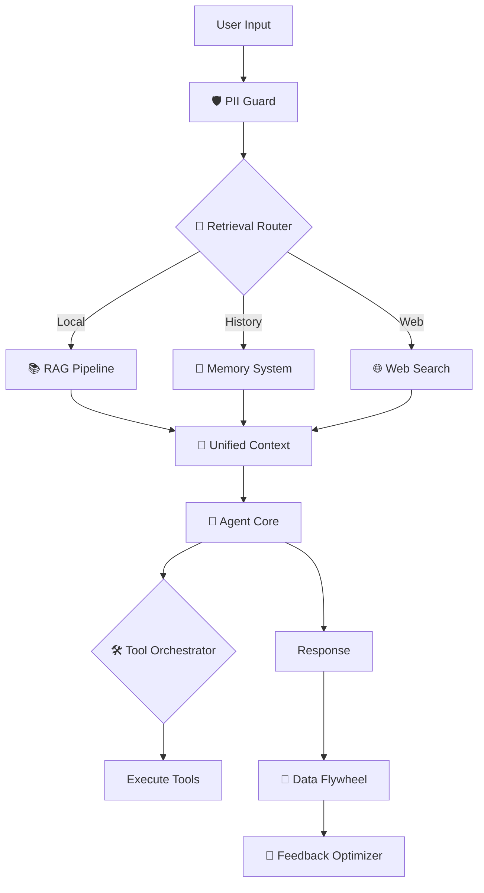

<p align="center">
  
</p>

<h1 align="center">Dory</h1>

<p align="center">
  <strong>Your co-worker with full system access, powered by NVIDIA NIM</strong>
</p>

<p align="center">
  <a href="#features">Features</a> •
  <a href="#modes">Modes</a> •
  <a href="#tools">Tools</a> •
  <a href="#settings">Settings</a> •
  <a href="#architecture">Architecture</a> •
  <a href="#getting-started">Setup</a>
</p>

---

## Overview

Dory is a local-first AI co-worker that can read/write files, execute commands, search the web, and remember context across sessions. Built on NVIDIA NIM with a terminal-style interface.

**Not a chatbot.** Dory takes action - creates files, runs builds, searches documentation, analyzes repos.

**Default Model:** Nemotron 3 Nano 30B (MoE) - 1M context window, 3.3x faster throughput

---

## Quick Start

```bash
# Clone and install
git clone https://github.com/caser-legal/nvidia-cli.git
cd nvidia-cli
npm install

# Add your API key
echo "NVIDIA_API_KEY=nvapi-xxx" > .env.local

# Run
npm run dev
```

Or use the shell alias:
```bash
# Add to ~/.zshrc
alias nv="cd /path/to/nvidia-cli && ./start.sh"
alias nvquit="pkill -f 'next dev'"

# Then just type
nv
```

Open [http://localhost:3000](http://localhost:3000)

---

## Features

### Terminal-Style Interface
- macOS-style traffic light buttons (functional)
  - 🔴 Red: Delete chat & start fresh
  - 🟡 Yellow: Minimize to sidebar & new chat
  - 🟢 Green: Minimize to sidebar & new chat
- Live clock with seconds
- Real-time metrics (tokens/sec, total tokens, elapsed time)
- Auto-expanding textarea input
- Syntax-highlighted code blocks

### Intelligence Layer
| Component | Description |
|-----------|-------------|
| **Retrieval Router** | Decides: RAG vs Web vs Memory for each query |
| **Tool Orchestrator** | Dynamically selects which tools to use |
| **Feedback Optimizer** | Learns from failures, generates "Golden Examples" |
| **Auto RAG Updater** | Ingests high-quality interactions into knowledge base |

### Security & Privacy
- **PII Guard**: Auto-redacts emails, phones, API keys, IPs from logs
- **Tool Guard**: Permission system for sensitive operations
- **Local Storage**: Conversations stored on your machine, not cloud
- **Tracer**: Full observability of every action

---

## Modes

| Mode | Description |
|------|-------------|
| **🐠 Dory** | Full autonomy with all 24 tools. Handles coding, research, file ops, web search. Default mode. |
| **👥 Dory (Supervised)** | Multi-agent research with quality review loops. Uses specialist agents that check each other's work. Takes longer but more thorough. |

---

## Tools (24)

### Project Management
| Tool | Description |
|------|-------------|
| `set_project` | Switch working directory for file operations |
| `get_project` | Show current working directory |

### File System
| Tool | Description |
|------|-------------|
| `file_read` | Read files or list directory contents |
| `file_write` | Create, overwrite, or edit files |

### System
| Tool | Description |
|------|-------------|
| `bash` | Execute any shell command (git, curl, python, xcodebuild, etc.) |

### Reasoning
| Tool | Description |
|------|-------------|
| `think` | Internal reasoning for complex problem solving |

### Memory
| Tool | Description |
|------|-------------|
| `memory` | Store/retrieve information across conversations |
| `entity_memory` | Track people, projects, companies, technologies |

### Search
| Tool | Description |
|------|-------------|
| `google_search` | Search Google |
| `tavily_search` | AI-optimized search with content extraction |
| `parallel_search` | Multiple Google searches simultaneously |
| `parallel_tavily_search` | Multiple Tavily searches simultaneously |
| `local_docs_search` | Search local documentation files |

### Code
| Tool | Description |
|------|-------------|
| `github_analyzer` | Clone and analyze GitHub repositories |
| `github_file_reader` | Read specific files from cloned repos |
| `code_documentation` | Generate documentation for codebases |

### Diagrams
| Tool | Description |
|------|-------------|
| `mermaid_generator` | Create Mermaid diagrams for architecture |
| `quick_diagram` | Fast diagram generation using templates |

### RAG (Retrieval-Augmented Generation)
| Tool | Description |
|------|-------------|
| `rag_ingest` | Add documents to knowledge base |
| `rag_search` | Semantic search over ingested docs |
| `rag_query` | Ask questions about your documents |
| `rag_research` | Deep research with query decomposition |
| `rag_stats` | Show RAG database statistics |
| `rag_clear` | Clear all documents from RAG |

---

## Settings

Full settings page at `/settings` (or press `⌘ ,`):

### Appearance
- **Theme**: Light / Dark / System (auto)
- **Font Size**: Small / Medium / Large
- **Code Theme**: One Dark / GitHub / Dracula

### API Configuration
- NVIDIA API key management (saves to `.env.local`)
- Model info and documentation

### Usage Statistics
- Total tokens used
- Conversation count
- Activity log (last 60 sessions)
- Reset stats button

### Available Tools
- Expandable documentation for all 24 tools
- Shows: description, how it works, example usage

### Keyboard Shortcuts
| Shortcut | Action |
|----------|--------|
| `⌘ ,` | Open Settings |
| `Enter` | Send message |
| `Shift + Enter` | New line in input |
| `Ctrl + U` | Clear input |

### About
Beginner-friendly explanations of:
- What Dory is and how it works
- Tools, Tokens, RAG, Context, Memory
- Privacy and data handling
- Mode differences

---

## Architecture



### RAG System
Based on NVIDIA RAG Blueprint:
- **Embeddings**: `nvidia/llama-3.2-nv-embedqa-1b-v2` (2048 dimensions)
- **Reranker**: `nvidia/llama-3.2-nv-rerankqa-1b-v2`
- **Query Decomposition**: Breaks complex queries into sub-queries
- **Reflection**: Checks context relevance and response groundedness

### Data Flywheel
Based on NVIDIA Data Flywheel Blueprint:
- Logs all interactions with timing
- Creates train/eval/test datasets
- LLM-as-Judge quality scoring
- Feedback loop for continuous improvement

### Memory System
| Type | Persistence | Location |
|------|-------------|----------|
| Short-term | Session only | In-memory |
| Long-term | Permanent | `~/.nvidia-cli/memory.json` |
| Entity | Permanent | Tracks people, projects, companies |

---

## Models

| Model | Context | Best For |
|-------|---------|----------|
| **Nemotron 3 Nano 30B** (default) | 1M tokens | Fast reasoning, general tasks |
| Nemotron Super 49B | 128K | Agentic coding |
| Nemotron Ultra 253B | 128K | Maximum capability |
| Llama 3.3 70B | 128K | General purpose |

---

## Project Structure

```
nvidia-cli/
├── app/
│   ├── page.tsx              # Main chat interface
│   ├── settings/page.tsx     # Settings page
│   └── api/
│       ├── agent-chat/       # Main agent endpoint
│       └── settings/         # Settings API
├── components/
│   ├── agents/
│   │   └── agent-chat.tsx    # Terminal-style chat UI
│   ├── sidebar/              # Session list, navigation
│   └── settings/             # Settings components
├── lib/
│   ├── agents/
│   │   ├── agent.ts          # Core agent loop
│   │   ├── tools/            # 24 tool implementations
│   │   ├── rag/              # RAG pipeline
│   │   ├── flywheel/         # Data logging
│   │   └── observability/    # Tracing
│   ├── store/                # Zustand state management
│   └── security/             # PII & Tool guards
└── public/                   # Static assets
```

---

## Environment Variables

```env
NVIDIA_API_KEY=nvapi-xxx          # Required
TAVILY_API_KEY=tvly-xxx           # Optional: Tavily search
GOOGLE_API_KEY=xxx                # Optional: Google search
GOOGLE_CSE_ID=xxx                 # Optional: Google search
```

Get your free NVIDIA API key at [build.nvidia.com](https://build.nvidia.com)

---

## NeMo Agent Toolkit (Optional)

For production-grade infrastructure:

```bash
./bin/setup-nat
./bin/start-all
```

Adds: Phoenix observability, MCP server, profiling, evaluation via `nat eval`.

---

## License

MIT

---

<p align="center">
  Built with <a href="https://nextjs.org">Next.js</a> and <a href="https://build.nvidia.com">NVIDIA NIM</a>
</p>
