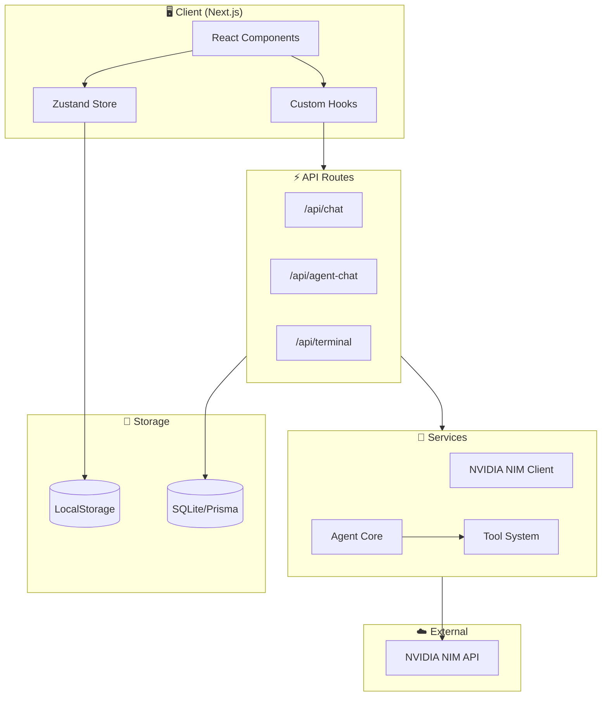
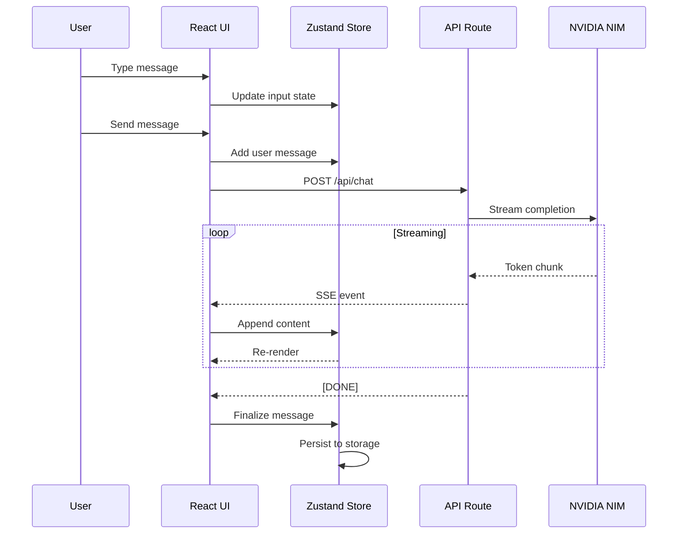
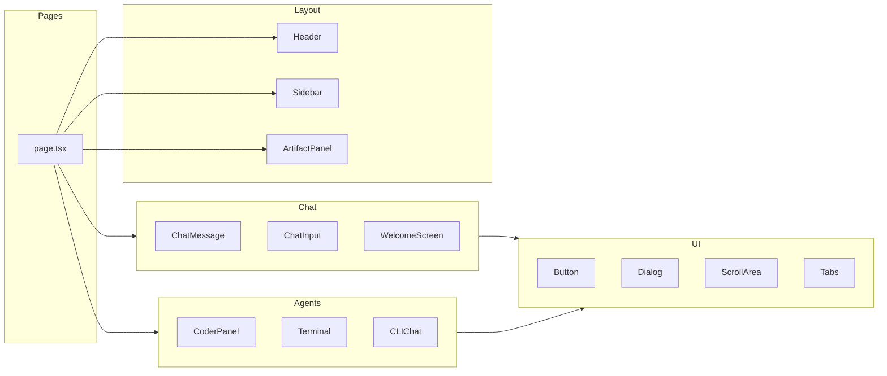
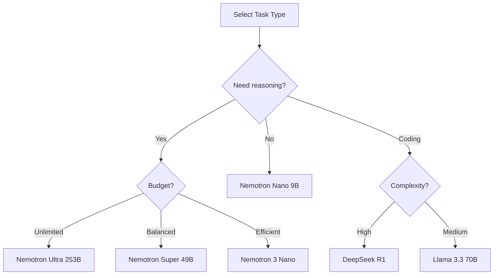
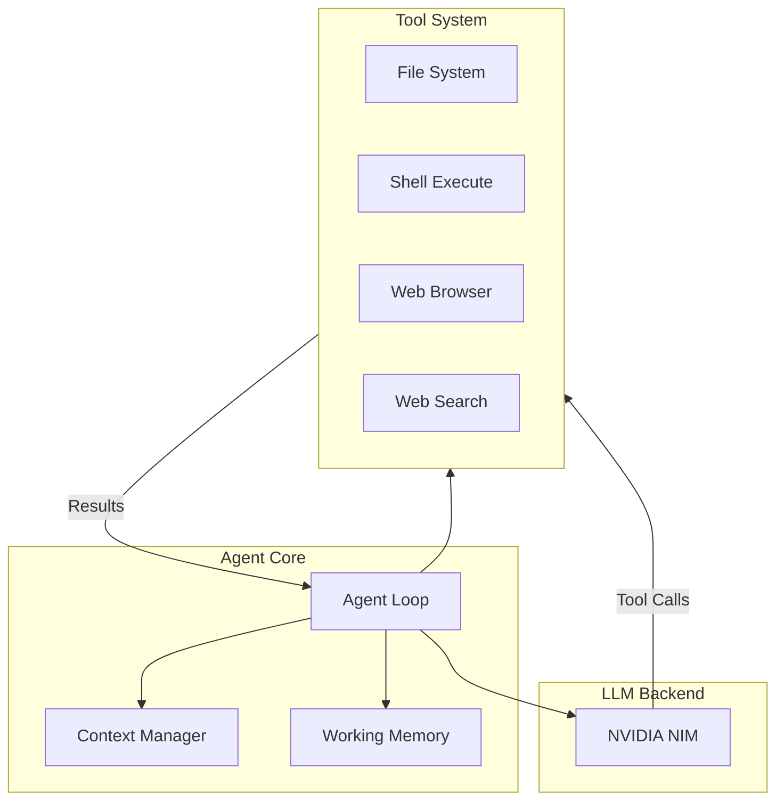
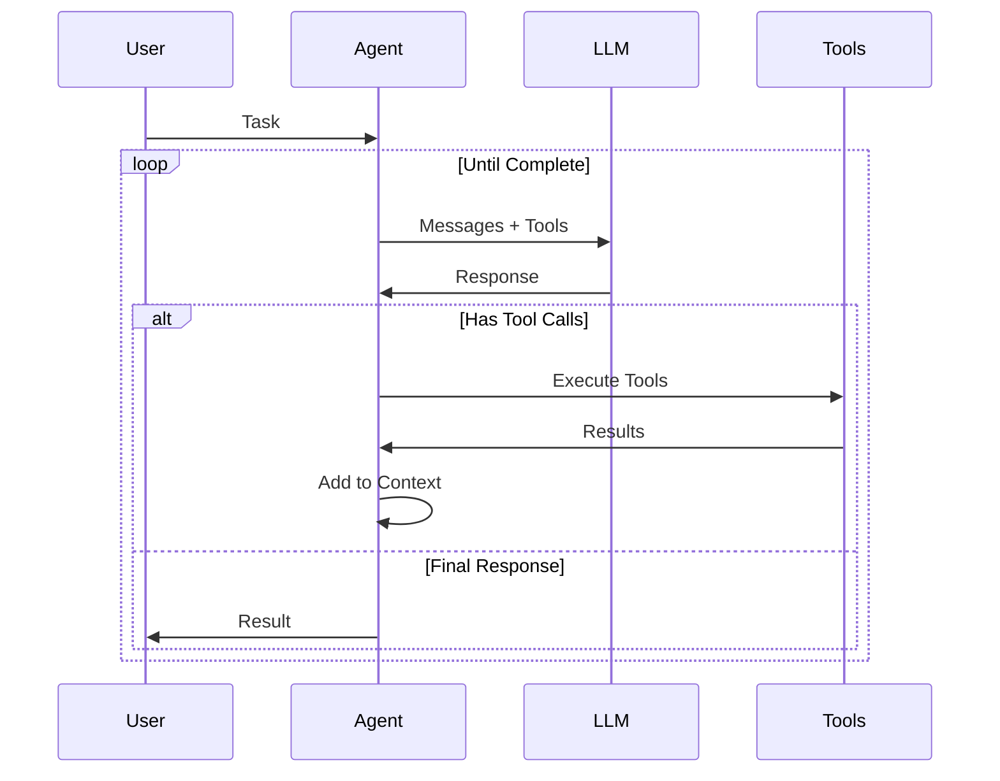
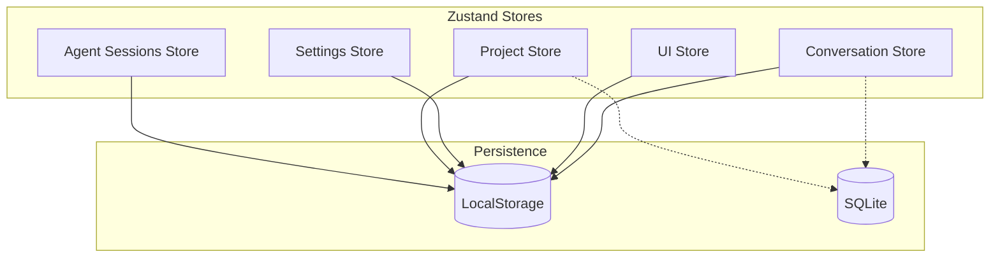
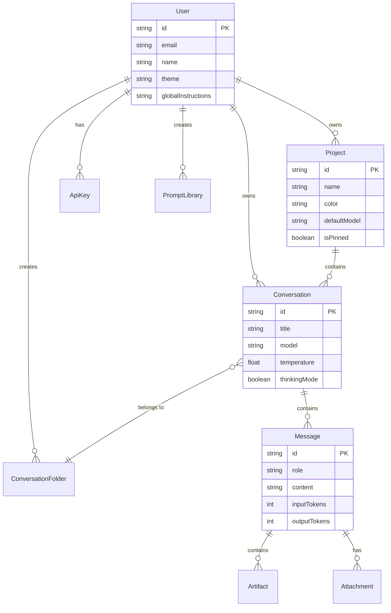

<p align="center">
  
</p>

<h1 align="center">NVIDIA CLI</h1>

<p align="center">
  <strong>A powerful, privacy-first chat interface powered by NVIDIA NIM</strong>
</p>

<p align="center">
  <a href="#features">Features</a> •
  <a href="#architecture">Architecture</a> •
  <a href="#getting-started">Getting Started</a> •
  <a href="#models">Models</a> •
  <a href="#agents">Agents</a> •
  <a href="#api-reference">API</a>
</p>

---

## Overview

NVIDIA CLI [codename: dory] is a full-featured application that connects to NVIDIA's NIM (NVIDIA Inference Microservices) API. It provides a IDE-like interface in a CLI setting with advanced features including multi-model support, agentic workflows, code execution, and artifact generation.

```
┌─────────────────────────────────────────────────────────────────────────┐
│                           NVIDIA CLI                                    │
├─────────────────────────────────────────────────────────────────────────┤
│  ┌──────────┐  ┌─────────────────────────────┐  ┌────────────────────┐  │
│  │          │  │                             │  │                    │  │
│  │ Sidebar  │  │      Chat Interface         │  │  Artifact Panel    │  │
│  │          │  │                             │  │                    │  │
│  │ • Chats  │  │  ┌─────────────────────┐    │  │  • Code Preview    │  │
│  │ • Folders│  │  │ Message History     │    │  │  • HTML Render     │  │
│  │ • Search │  │  │                     │    │  │  • Mermaid         │  │
│  │ • Models │  │  └─────────────────────┘    │  │  • React Live      │  │
│  │          │  │                             │  │                    │  │
│  │          │  │  ┌─────────────────────┐    │  │                    │  │
│  │          │  │  │ Input + Attachments │    │  │                    │  │
│  │          │  │  └─────────────────────┘    │  │                    │  │
│  └──────────┘  └─────────────────────────────┘  └────────────────────┘  │
└─────────────────────────────────────────────────────────────────────────┘
```

---

## Features

### 🎯 Core Chat Features
- **Multi-model support** - Switch between 15+ NVIDIA NIM models
- **Streaming responses** - Real-time token streaming with metrics
- **Conversation management** - Create, rename, pin, archive, delete
- **Message editing** - Edit and regenerate any message
- **Branching** - Create conversation branches from any point
- **Search** - Full-text search across all conversations

### 🤖 Agent Modes
- **Talk** - Standard conversational assistant
- **Code** - Autonomous coding agent with file system access
- **Control** - Desktop automation agent
- **Browse** - Web research and scraping agent
- **Research** - Multi-step deep research with citations

### 🎨 Artifacts
- **Code blocks** - Syntax highlighted with 50+ languages
- **HTML/CSS** - Live preview with sandboxed iframe
- **React components** - Live rendering with error boundaries
- **Mermaid diagrams** - Flowcharts, sequence diagrams, etc.
- **SVG graphics** - Vector graphics preview
- **Markdown** - Rich text rendering

### ⚙️ Advanced Features
- **Thinking modes** - Enable/disable reasoning traces
- **Parallel reasoning** - Multiple reasoning paths (Nemotron 3 Nano)
- **Thinking budget** - Control reasoning depth
- **Custom instructions** - Global and per-project prompts
- **Prompt templates** - Reusable prompt library
- **Keyboard shortcuts** - Full keyboard navigation
- **Command palette** - Quick actions (Cmd+K)

---

## Architecture

### System Overview



### Data Flow



### Component Architecture



---

## Project Structure

```
nvidia-cli/
├── app/                      # Next.js App Router
│   ├── api/                  # API Routes
│   │   ├── chat/            # Chat completion endpoint
│   │   ├── agent-chat/      # Agent mode endpoint
│   │   ├── agents/          # Agent management
│   │   └── terminal/        # Terminal WebSocket
│   ├── layout.tsx           # Root layout
│   ├── page.tsx             # Main chat page
│   └── globals.css          # Global styles
│
├── components/               # React Components
│   ├── agents/              # Agent-specific components
│   │   ├── cli-chat.tsx     # CLI-style chat interface
│   │   ├── coder-panel.tsx  # Coder agent panel
│   │   ├── terminal.tsx     # Terminal emulator
│   │   └── terminal-inner.tsx
│   ├── artifacts/           # Artifact rendering
│   │   └── artifact-panel.tsx
│   ├── chat/                # Chat components
│   │   ├── chat-input.tsx   # Message input
│   │   ├── chat-message.tsx # Message display
│   │   └── welcome-screen.tsx
│   ├── layout/              # Layout components
│   │   └── header.tsx
│   ├── settings/            # Settings components
│   │   ├── settings-modal.tsx
│   │   └── keyboard-shortcuts.tsx
│   ├── sidebar/             # Sidebar components
│   │   └── sidebar.tsx
│   ├── ui/                  # Radix UI primitives
│   └── providers/           # Context providers
│
├── lib/                      # Core Libraries
│   ├── agents/              # Agent system
│   │   ├── agent.ts         # Agent core loop
│   │   ├── types.ts         # Agent types
│   │   ├── base-tool.ts     # Tool base class
│   │   └── tools/           # Built-in tools
│   ├── store/               # Zustand stores
│   │   ├── index.ts         # Main store
│   │   ├── conversations.ts # Conversation store
│   │   └── agent-sessions.ts
│   ├── nvidia.ts            # NVIDIA NIM client
│   └── utils.ts             # Utilities
│
├── prisma/                   # Database
│   ├── schema.prisma        # Schema definition
│   └── dev.db               # SQLite database
│
└── public/                   # Static assets
```

---

## Getting Started

### Prerequisites

- Node.js 18+
- npm or yarn
- NVIDIA API Key ([Get one here](https://build.nvidia.com))

### Installation

```bash
# Clone the repository
git clone https://github.com/your-org/nvidia-cli.git
cd nvidia-cli

# Install dependencies
npm install

# Set up environment
cp .env.example .env.local
# Edit .env.local and add your NVIDIA_API_KEY

# Initialize database
npm run db:push

# Start development server
npm run dev
```

### Environment Variables

```env
# Required
NVIDIA_API_KEY=nvapi-xxxxxxxxxxxxxxxxxxxxxxxxxxxx

# Optional
NVIDIA_API_BASE=https://integrate.api.nvidia.com/v1
```

### Running

```bash
# Development (chat only)
npm run dev

# Development with terminal support
npm run dev:all

# Production build
npm run build
npm run start
```

---

## Models

### Supported NVIDIA NIM Models

| Model | Context | Features | Best For |
|-------|---------|----------|----------|
| **Nemotron 3 Nano** | 1M | Parallel reasoning, thinking budget | Complex reasoning |
| **Nemotron Nano 9B v2** | 128K | Thinking budget control | Efficient tasks |
| **Nemotron Super 49B v1.5** | 128K | /no_think support | Agentic tasks |
| **Nemotron Ultra 253B** | 128K | Largest model | Maximum capability |
| **DeepSeek V3.1** | 128K | Think/Non-Think modes | Hybrid inference |
| **DeepSeek R1** | 128K | State-of-the-art reasoning | Math, coding |
| **Llama 3.3 70B** | 128K | Tool use, general purpose | Versatile tasks |
| **Qwen 2.5 72B** | 128K | Multilingual | International |
| **Mistral Large 2** | 128K | Code, reasoning | Development |

### Model Selection



---

## Agents

### Agent Architecture



### Agent Loop



### Available Modes

#### 💬 Talk
Standard conversational assistant with optional thinking modes.

#### 💻 Code
Autonomous coding agent with:
- File system read/write
- Shell command execution
- Code analysis and refactoring
- Test generation

#### 🖥️ Control
Desktop automation with:
- Screenshot capture
- Mouse/keyboard control
- Application interaction

#### 🌐 Browse
Web research with:
- Page navigation
- Content extraction
- Form interaction
- Screenshot capture

#### 🔬 Research
Multi-step deep research with:
- Query decomposition
- Source gathering
- Citation tracking
- Report generation

---

## State Management

### Store Architecture



### Conversation Store

```typescript
interface ConversationState {
  conversations: Conversation[];
  currentConversationId: string | null;
  isStreaming: boolean;
  streamingContent: string;
  
  // Actions
  createConversation: (projectId?: string) => string;
  deleteConversation: (id: string) => void;
  updateConversation: (id: string, updates: Partial<Conversation>) => void;
  addMessage: (conversationId: string, message: Message) => void;
  updateMessage: (conversationId: string, messageId: string, updates: Partial<Message>) => void;
  // ... more actions
}
```

### UI Store

```typescript
interface UIState {
  sidebarOpen: boolean;
  artifactPanelOpen: boolean;
  settingsModalOpen: boolean;
  commandPaletteOpen: boolean;
  agentMode: AgentMode;
  theme: 'light' | 'dark' | 'system';
  
  // Actions
  toggleSidebar: () => void;
  openArtifactPanel: () => void;
  setAgentMode: (mode: AgentMode) => void;
  // ... more actions
}
```

---

## API Reference

### Chat Endpoint

```
POST /api/chat
```

**Request:**
```typescript
{
  messages: Array<{
    role: 'user' | 'assistant' | 'system';
    content: string;
  }>;
  model: string;
  temperature?: number;
  max_tokens?: number;
  stream?: boolean;
}
```

**Response (Streaming):**
```
data: {"choices":[{"delta":{"content":"Hello"}}]}
data: {"choices":[{"delta":{"content":" world"}}]}
data: [DONE]
```

### Agent Chat Endpoint

```
POST /api/agent-chat
```

**Request:**
```typescript
{
  message: string;
  sessionId?: string;
  agentType: 'coder' | 'computer' | 'browser' | 'research';
  projectDir?: string;
}
```

**Response (Streaming):**
```
data: {"type":"status","status":"running"}
data: {"type":"tool_call","name":"read_file","args":"..."}
data: {"type":"tool_result","name":"read_file","result":"..."}
data: {"type":"message","role":"assistant","content":"..."}
data: {"type":"status","status":"complete"}
```

---

## Keyboard Shortcuts

| Shortcut | Action |
|----------|--------|
| `Cmd + K` | Open command palette |
| `Cmd + N` | New conversation |
| `Cmd + /` | Toggle sidebar |
| `Cmd + Enter` | Send message |
| `Cmd + Shift + C` | Copy last response |
| `Cmd + .` | Stop generation |
| `Escape` | Close modal/panel |
| `Cmd + ,` | Open settings |
| `Cmd + ?` | Show shortcuts |

---

## Database Schema



---

## Performance

### Optimizations

- **Virtualized lists** - Only render visible messages
- **Streaming** - Real-time token display
- **Lazy loading** - Code split components
- **Memoization** - Prevent unnecessary re-renders
- **IndexedDB** - Large conversation storage

### Metrics

| Metric | Target | Actual |
|--------|--------|--------|
| First Contentful Paint | < 1.5s | ~1.2s |
| Time to Interactive | < 3s | ~2.5s |
| Message render | < 16ms | ~8ms |
| Store update | < 5ms | ~2ms |

---

## Contributing

1. Fork the repository
2. Create a feature branch (`git checkout -b feature/amazing`)
3. Commit changes (`git commit -m 'Add amazing feature'`)
4. Push to branch (`git push origin feature/amazing`)
5. Open a Pull Request

---

## License

MIT License - see [LICENSE](LICENSE) for details.

---

<p align="center">
  Built with ❤️ using <a href="https://nextjs.org">Next.js</a> and <a href="https://build.nvidia.com">NVIDIA NIM</a>
</p>
