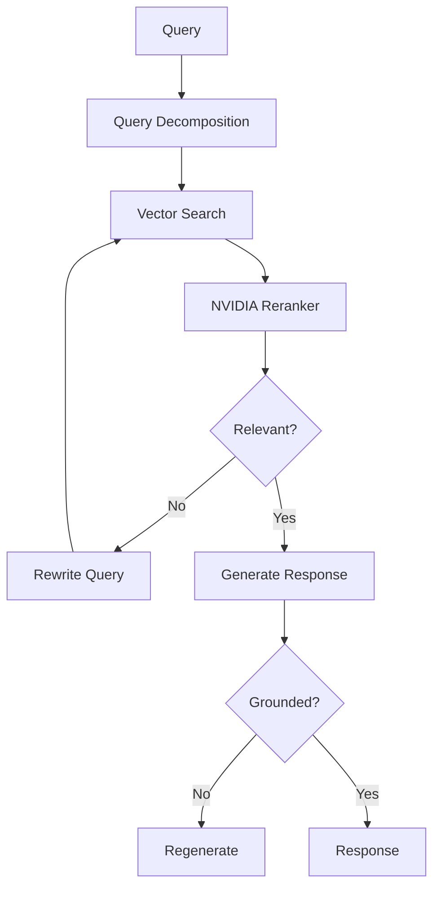
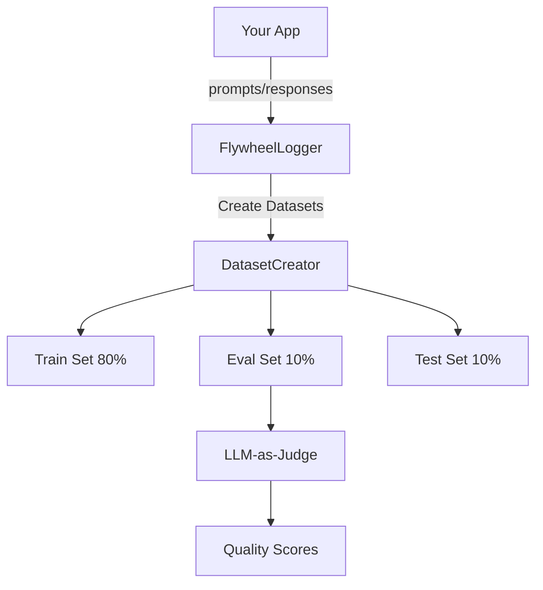
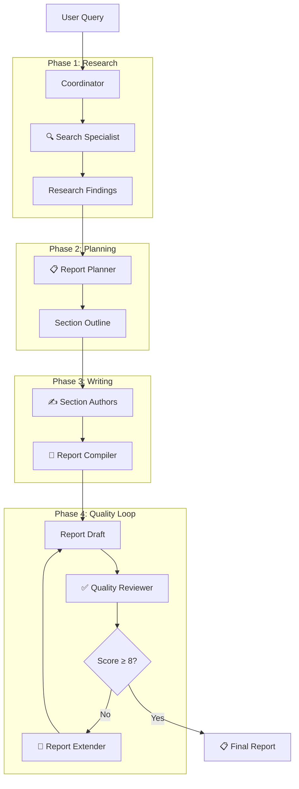

<p align="center">
  
</p>

<h1 align="center">NVIDIA CLI</h1>

<p align="center">
  <strong>A powerful, privacy-first AI assistant powered by NVIDIA NIM</strong>
</p>

<p align="center">
  <a href="#features">Features</a> •
  <a href="#modes">Modes</a> •
  <a href="#rag-system">RAG System</a> •
  <a href="#data-flywheel">Data Flywheel</a> •
  <a href="#multi-agent-coordinator">Multi-Agent</a> •
  <a href="#models">Models</a> •
  <a href="#getting-started">Getting Started</a>
</p>

---

## Overview

NVIDIA CLI [codename: **dory**] is a full-featured AI application implementing patterns from official NVIDIA AI Blueprints:

- **RAG Blueprint** - NVIDIA embeddings, reranking, query decomposition, reflection
- **Data Flywheel Blueprint** - Production logging, LLM-as-Judge, dataset creation
- **AIQ Research Assistant** - Multi-step research with reflection loops
- **Agent Workshop** - LangGraph-style state machines, ReAct pattern

**Default Model:** Nemotron 3 Nano 30B - 1M context, 3.3x faster throughput

---

## Features

| Category | Features |
|----------|----------|
| **Core Chat** | Multi-model support, streaming responses, markdown rendering, conversation management |
| **RAG System** | NVIDIA embeddings + reranking, query decomposition, reflection, research workflows |
| **Data Flywheel** | Interaction logging, dataset creation, LLM-as-Judge evaluation |
| **Multi-Agent** | 8 specialist agents, quality scoring, reflection loops |
| **Tools** | File ops, bash, Tavily/Google search, GitHub analyzer, Mermaid diagrams |
| **Memory** | Short-term, long-term, entity tracking across sessions |

---

## Modes

| Mode | Description | Key Tools |
|------|-------------|-----------|
| **💬 Chat** | General assistant | Memory, entity tracking |
| **💻 Coder** | Autonomous coding | GitHub analyzer, Mermaid diagrams |
| **📄 Docs** | Documentation generator | Code documentation, architecture diagrams |
| **🖥️ Controller** | Computer automation | Bash, file operations |
| **🌐 Browser** | Web browsing | Tavily, Google search |
| **🔬 Research** | Deep research | Parallel search, RAG |
| **👥 Coordinator** | Multi-agent research | All specialist agents |

---

## RAG System

Full RAG pipeline based on NVIDIA RAG Blueprint with embeddings, reranking, and reflection.

### Architecture



### Components

| Component | Model/Description |
|-----------|-------------------|
| **Embeddings** | `nvidia/llama-3.2-nv-embedqa-1b-v2` - 2048 dimensions |
| **Reranker** | `nvidia/llama-3.2-nv-rerankqa-1b-v2` - Relevance scoring |
| **Query Decomposition** | Breaks complex queries into sub-queries |
| **Reflection** | Context relevance + response groundedness checking |
| **Research Workflow** | AIQ-style iterative research with reflection |

### RAG Tools

```typescript
// Ingest documents into knowledge base
rag_ingest({ documents: [{ id: "doc1", content: "...", metadata: { source: "file.txt" } }] })

// Search with NVIDIA embeddings + reranking
rag_search({ query: "your question", top_k: 5 })

// Generate answer with reflection
rag_query({ query: "your question", system_prompt: "..." })

// Full research workflow with iteration
rag_research({ topic: "research topic", max_iterations: 3 })

// Get knowledge base stats
rag_stats()

// Clear knowledge base
rag_clear()
```

### Implementation Files

```
lib/agents/rag/
├── types.ts              # Document, SearchResult, WorkflowState types
├── embeddings.ts         # NVIDIAEmbeddings, NVIDIAReranker, SimpleVectorStore
├── query-decomposition.ts # QueryDecomposer for complex queries
├── reflection.ts         # ReflectionSystem, ReflectionCounter
├── research-workflow.ts  # Full AIQ-style research workflow
├── pipeline.ts           # Unified RAGPipeline
└── index.ts              # Module exports
```

---

## Data Flywheel

Production data logging system based on NVIDIA Data Flywheel Blueprint for continuous model improvement.

### Architecture



### Components

| Component | Description |
|-----------|-------------|
| **FlywheelLogger** | Captures all agent interactions with timing |
| **ToolCallRecord** | Logs tool usage with arguments and results |
| **DatasetCreator** | Creates train/eval/test splits (80/10/10) |
| **FlywheelEvaluator** | LLM-as-Judge quality scoring |

### API Endpoints

```typescript
// Get flywheel stats
GET /api/flywheel?action=stats

// Get all records
GET /api/flywheel?action=records

// Export as JSONL for training
GET /api/flywheel?action=export&format=jsonl

// Add user feedback
POST /api/flywheel
{ "action": "feedback", "recordId": "...", "rating": 5, "feedback": "Great response" }

// Run LLM-as-Judge evaluation
POST /api/flywheel
{ "action": "evaluate" }

// Create training datasets
POST /api/flywheel
{ "action": "create_datasets" }
```

### Quality Signals

The evaluator scores responses on 5 dimensions (1-5 each):

| Dimension | What it measures |
|-----------|------------------|
| **Helpfulness** | Does it address the user's needs? |
| **Accuracy** | Is the information correct? |
| **Completeness** | Does it fully answer the question? |
| **Clarity** | Is it well-organized and clear? |
| **Safety** | Is it appropriate and safe? |

### Implementation Files

```
lib/agents/flywheel/
├── types.ts           # FlywheelRecord, ToolCallRecord, QualitySignals
├── logger.ts          # FlywheelLogger class
├── dataset-creator.ts # DatasetCreator with train/eval/test splits
├── evaluator.ts       # FlywheelEvaluator with LLM-as-Judge
└── index.ts           # Module exports

app/api/flywheel/
└── route.ts           # API endpoint for flywheel operations
```

---

## Multi-Agent Coordinator

Orchestrates specialist agents for comprehensive research with quality assurance.

### Architecture



### Specialist Agents

| Agent | Role |
|-------|------|
| **Search Specialist** | Comprehensive research with Tavily + Google + Local docs |
| **Report Planner** | Creates structured outline |
| **Section Author** | Writes individual sections |
| **Report Writer** | Quick full reports |
| **Quality Reviewer** | Evaluates completeness (0-10 scoring) |
| **Report Extender** | Integrates new findings |
| **Report Compiler** | Assembles final report |
| **Source Deduplicator** | Cleans citations |
| **Documentation Specialist** | Code documentation generation |

### Quality Scoring

Reports scored on 5 dimensions (0-10 each):
- **Completeness** - Fully answers the question?
- **Accuracy** - Claims supported by sources?
- **Clarity** - Well-organized and clear?
- **Citations** - Sources properly cited?
- **Depth** - Sufficient detail and analysis?

**Verdicts:** `APPROVED` (≥8), `NEEDS_REVISION`, `NEEDS_MORE_RESEARCH`

---

## Memory System

Persistent memory across sessions based on CrewAI patterns.

### Components

| Component | Description |
|-----------|-------------|
| **ShortTermMemory** | Session-based, in-memory storage |
| **LongTermMemory** | File-persisted at `~/.nvidia-cli/memory.json` |
| **EntityMemory** | Tracks people, projects, companies, technologies |

### Memory Tools

```typescript
// Remember a fact
memory({ operation: "remember", content: "User prefers dark mode" })

// Recall memories
memory({ operation: "recall", query: "user preferences" })

// List all memories
memory({ operation: "list" })

// Summarize session
memory({ operation: "summarize" })

// Promote to long-term
memory({ operation: "promote", memory_id: "..." })

// Clear memories
memory({ operation: "clear" })
```

### Entity Memory

```typescript
entity_memory({
  operation: "track",
  entity_type: "person",  // person, project, company, technology
  name: "John Smith",
  context: "Lead developer on the project"
})
```

---

## GitHub Analyzer

Clone and analyze public repositories.

```typescript
// Clone a repository
github_analyzer({ operation: "clone", repo_url: "https://github.com/owner/repo" })

// Get directory structure
github_analyzer({ operation: "structure", repo_url: "..." })

// Read README
github_analyzer({ operation: "readme", repo_url: "..." })

// List key files
github_analyzer({ operation: "files", repo_url: "..." })

// Analyze dependencies
github_analyzer({ operation: "dependencies", repo_url: "..." })

// Full analysis
github_analyzer({ operation: "analyze", repo_url: "..." })
```

---

## Code Documentation Generator

Generate comprehensive documentation for codebases.

```typescript
// Analyze codebase
code_documentation({ operation: "analyze", repo_url: "..." })

// Create documentation plan
code_documentation({ operation: "plan", repo_url: "..." })

// Generate README
code_documentation({ operation: "readme", repo_url: "..." })

// Generate architecture docs
code_documentation({ operation: "architecture", repo_url: "..." })

// Generate API docs
code_documentation({ operation: "api", repo_url: "..." })

// Full documentation suite
code_documentation({ operation: "full", repo_url: "..." })
```

---

## Mermaid Diagram Generator

AI-powered and template-based diagram generation.

### AI-Powered

```typescript
mermaid_generator({
  diagram_type: "flowchart",  // flowchart, sequenceDiagram, classDiagram, erDiagram, stateDiagram
  description: "User authentication flow with OAuth"
})
```

### Templates

```typescript
quick_diagram({ template: "api_flow", title: "User API" })
quick_diagram({ template: "crud_flow", title: "Posts" })
quick_diagram({ template: "auth_flow", title: "OAuth" })
quick_diagram({ template: "microservices", title: "E-commerce" })
quick_diagram({ template: "class_hierarchy", title: "Vehicles" })
quick_diagram({ template: "state_machine", title: "Order Status" })
```

---

## Search Tools

### Tavily Search (Primary)

```typescript
tavily_search({
  query: "AI agents 2025",
  topic: "general" | "news" | "finance",
  days: 7,
  include_raw_content: true
})
```

### Parallel Search

```typescript
parallel_tavily_search({
  queries: ["query 1", "query 2", "query 3"],
  topic: "news"
})
```

### Local Docs Search

Searches local documentation before web fallback.

---

## Models

| Model | Context | Best For |
|-------|---------|----------|
| **Nemotron 3 Nano 30B** (default) | 1M | Fast reasoning, 3.3x throughput |
| **Nemotron Super 49B** | 128K | Agentic coding tasks |
| **Nemotron Ultra 253B** | 128K | Maximum capability |
| **Qwen3 Coder 480B** | 128K | Code generation |
| **DeepSeek R1** | 128K | Math, reasoning |
| **Llama 3.3 70B** | 128K | General purpose |

---

## Getting Started

### Prerequisites
- Node.js 18+
- NVIDIA API Key ([Get one free](https://build.nvidia.com))

### Installation

```bash
git clone https://github.com/caser-legal/nvidia-cli.git
cd nvidia-cli
npm install
cp .env.example .env.local
# Add your NVIDIA_API_KEY to .env.local
npm run dev
```

Open [http://localhost:3000](http://localhost:3000)

### Environment Variables

```env
NVIDIA_API_KEY=nvapi-xxx          # Required
TAVILY_API_KEY=tvly-xxx           # Optional: For Tavily search
GOOGLE_API_KEY=xxx                # Optional: For Google search
GOOGLE_CSE_ID=xxx                 # Optional: For Google search
```

---

## Project Structure

```
nvidia-cli/
├── app/
│   ├── api/
│   │   ├── agent-chat/          # Multi-mode agent endpoint
│   │   └── flywheel/            # Data flywheel API
│   └── page.tsx
├── components/
│   ├── agents/
│   │   └── agent-chat.tsx       # Terminal UI
│   ├── chat/
│   └── ui/
├── lib/
│   ├── agents/
│   │   ├── agent.ts             # Main agent loop
│   │   ├── rag/                 # RAG system
│   │   │   ├── embeddings.ts
│   │   │   ├── query-decomposition.ts
│   │   │   ├── reflection.ts
│   │   │   ├── research-workflow.ts
│   │   │   └── pipeline.ts
│   │   ├── flywheel/            # Data flywheel
│   │   │   ├── logger.ts
│   │   │   ├── dataset-creator.ts
│   │   │   └── evaluator.ts
│   │   └── tools/
│   │       ├── tavily-search.ts
│   │       ├── github-analyzer.ts
│   │       ├── mermaid-generator.ts
│   │       ├── memory.ts
│   │       ├── code-documentation.ts
│   │       ├── rag-tools.ts
│   │       └── specialist-agents.ts
│   └── store/
└── public/
```

---

## NVIDIA Blueprints Implemented

| Blueprint | Status | Description |
|-----------|--------|-------------|
| **RAG Blueprint** | ✅ Implemented | Embeddings, reranking, query decomposition, reflection |
| **Data Flywheel** | ✅ Implemented | Logging, datasets, LLM-as-Judge evaluation |
| **AIQ Research Assistant** | ✅ Implemented | Research workflow with reflection loops |
| **Agent Workshop** | ✅ Implemented | LangGraph patterns, ReAct, multi-agent |

---

## Tech Stack

- **Framework:** Next.js 15 (App Router)
- **UI:** React 19, Tailwind CSS, shadcn/ui
- **State:** Zustand with localStorage persistence
- **API:** NVIDIA NIM (OpenAI-compatible)
- **Search:** Tavily (primary), Google Custom Search (fallback)
- **Embeddings:** NVIDIA NIM Embeddings API
- **Reranking:** NVIDIA NIM Reranking API

---

## License

MIT

---

<p align="center">
  Built with ❤️ using <a href="https://nextjs.org">Next.js</a> and <a href="https://build.nvidia.com">NVIDIA NIM</a>
</p>
