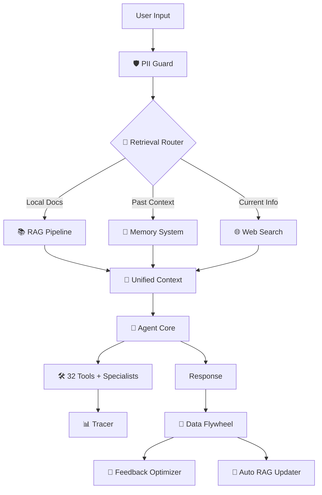
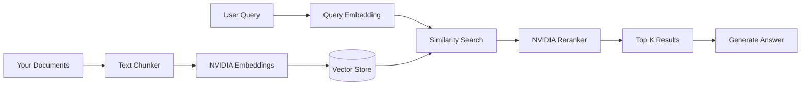

<p align="center">
  
</p>

<h1 align="center">Dory</h1>

<p align="center">
  <strong>Your co-worker with full system access, powered by NVIDIA NIM</strong>
</p>

<p align="center">
  <a href="#overview">Overview</a> •
  <a href="#quick-start">Quick Start</a> •
  <a href="#interface">Interface</a> •
  <a href="#capabilities">Capabilities</a> •
  <a href="#tools-32">Tools</a> •
  <a href="#settings">Settings</a> •
  <a href="#architecture">Architecture</a> •
  <a href="#rag-system">RAG</a> •
  <a href="#data-flywheel">Flywheel</a> •
  <a href="#memory-system">Memory</a> •
  <a href="#security">Security</a> •
  <a href="#models">Models</a> •
  <a href="#context-limits">Context Limits</a> •
  <a href="#project-structure">Structure</a>
</p>

---

## Project Purpose

> **Dory is a private enterprise iOS/SwiftUI coding agent designed for large codebase handling.**
>
> This application is exclusively for private use by a single developer. The primary objective is to eliminate traditional constraints that have historically limited AI assistants on exceptionally large iOS SwiftUI projects - specifically time limits, context size restrictions, and file count limitations.
>
> **Target use case:** 100k+ line iOS projects with 500+ Swift files, XIBs, storyboards, and assets.

### Why This Architecture

| Constraint | Traditional AI | Dory's Solution |
|------------|----------------|-----------------|
| Context limits | 8-32k tokens | 1M tokens via Nemotron 3 Nano |
| File awareness | Single file at a time | RAG indexes entire Xcode project |
| Session memory | Forgets between chats | Persistent memory across sessions |
| Reasoning depth | Quick responses | Extended reasoning with tool-integrated thinking |

### NVIDIA Stack (Optimized for iOS Development)

| Component | Purpose |
|-----------|---------|
| **Nemotron 3 Nano 1M context** | Hold ~750k lines of Swift in context at once |
| **nvidia/llama-3.2-nv-embedqa-1b-v2** | Embed and index entire Xcode projects |
| **nvidia/llama-3.2-nv-rerankqa-1b-v2** | Retrieve most relevant files for any task |

**Not using:** Nemotron Safety (private use), Personas datasets (not consumer chatbot), RL fine-tuning datasets.

---

## Overview

Dory is a local-first AI co-worker that can read/write files, execute commands, search the web, and remember context across sessions. Built on NVIDIA NIM with a terminal-style interface.

**Not a chatbot.** Dory takes action - creates files, runs builds, searches documentation, analyzes repos.

### What Makes Dory Different

| Traditional Chatbot | Dory |
|---------------------|------|
| Only gives answers | Takes action on your system |
| Forgets everything | Remembers across sessions |
| No file access | Full filesystem access |
| No command execution | Runs any shell command |
| Generic responses | Learns from your codebase via RAG |
| Single-pass answers | Multi-agent quality review for complex tasks |

**Default Model:** Nemotron 3 Nano 30B (MoE) - 1M native context, 262K hosted API limit

---

## Quick Start

```bash
# Clone and install
git clone https://github.com/caser-legal/nvidia-cli.git
cd nvidia-cli
npm install

# Add your API key
echo "NVIDIA_API_KEY=nvapi-xxx" > .env.local

# Run
npm run dev
```

### Shell Aliases (Recommended)

Add to `~/.zshrc`:
```bash
alias nv="cd /path/to/nvidia-cli && ./start.sh"
alias nvquit="pkill -f 'next dev'"
```

Then just type `nv` to start.

Open [http://localhost:3000](http://localhost:3000)

---

## Interface

### Terminal-Style Design

The interface mimics a macOS terminal window with functional controls:

```
┌─────────────────────────────────────────────────────────────┐
│ 🔴 🟡 🟢  12/23/2024 10:05:23 AM       15 tok/s  238 tokens│
├─────────────────────────────────────────────────────────────┤
│                                                             │
│  [Dory] Here's what's in your directory:                    │
│  - README.md                                                │
│  - package.json                                             │
│  - src/                                                     │
│                                           Total 238 tokens  │
├─────────────────────────────────────────────────────────────┤
│ ❯ Type your message here...                          [Send] │
└─────────────────────────────────────────────────────────────┘
```

### Traffic Light Buttons

| Button | Action |
|--------|--------|
| 🔴 Red | Delete current chat and start fresh |
| 🟡 Yellow | Minimize chat to sidebar, start new chat |
| 🟢 Green | Minimize chat to sidebar, start new chat |

### Header Metrics

| Metric | Description |
|--------|-------------|
| **Live Clock** | Current date and time, updates every second |
| **tok/s** | Tokens generated per second (speed indicator) |
| **tokens** | Total tokens used in current response |
| **elapsed** | Time since response started (shows Xm Ys when > 60s) |

### Keyboard Shortcuts

| Shortcut | Action |
|----------|--------|
| `Enter` | Send message |
| `Shift + Enter` | New line in input |
| `Ctrl + U` | Clear input |
| `⌘ ,` | Open Settings |

---

## Capabilities

Dory has **all capabilities always enabled**. No mode switching - quality over speed.

### Core Capabilities

| Capability | Description |
|------------|-------------|
| **iOS Development** | SwiftUI, Xcode builds, code signing, entitlements |
| **File Operations** | Read, write, edit files and directories |
| **System Commands** | Run any shell command via bash |
| **Web Search** | Google and Tavily with parallel queries |
| **RAG & Memory** | Persistent context across sessions |
| **GitHub Analysis** | Clone and analyze repositories |
| **Diagrams** | Generate Mermaid architecture diagrams |

### Specialist Agents (Always Available)

For complex research and documentation tasks, Dory automatically delegates to specialist sub-agents:

| Specialist | Purpose |
|------------|---------|
| `search_specialist` | Deep multi-source research with quality scoring |
| `report_planner` | Creates structured outlines for complex deliverables |
| `section_author` | Writes individual sections with citations |
| `report_writer` | Fast full draft generation |
| `quality_reviewer` | Evaluates output with 0-10 scores, flags gaps |
| `report_extender` | Merges new findings into existing reports |
| `report_compiler` | Final assembly and formatting |
| `deduplicate_sources` | Cleans and deduplicates citations |
| `documentation_specialist` | Generates codebase documentation |

### Multi-Agent Workflow

For complex tasks, Dory uses this workflow:

```
User Query
    ↓
🔍 search_specialist (gather comprehensive information)
    ↓
📋 report_planner (if deliverable is structured)
    ↓
✍️ section_author (write each section)
    ↓
📄 report_compiler (assemble final output)
    ↓
✅ quality_reviewer → loop until score ≥ 8/10 or max 3 iterations
    ↓
Final Output
```

---

## Tools (32)

Dory has 32 tools organized into categories. All tools are always available.

### Project Management (2)

| Tool | Description |
|------|-------------|
| `set_project` | Sets working directory for all operations |
| `get_project` | Returns current working directory |

### File System (2)

| Tool | Description |
|------|-------------|
| `file_read` | Read file contents or list directories |
| `file_write` | Create, overwrite, or edit files |

### System (1)

| Tool | Description |
|------|-------------|
| `bash` | Execute any shell command |

### Reasoning (1)

| Tool | Description |
|------|-------------|
| `think` | Internal reasoning for complex problems |

### Memory (2)

| Tool | Description |
|------|-------------|
| `memory` | Store/retrieve info across sessions |
| `entity_memory` | Track people, projects, companies |

### Search (5)

| Tool | Description |
|------|-------------|
| `google_search` | Google Custom Search |
| `tavily_search` | AI-optimized search with content extraction |
| `parallel_search` | Multiple Google searches in parallel |
| `parallel_tavily_search` | Multiple Tavily searches in parallel |
| `local_docs_search` | Search local documentation files |

### Code (4)

| Tool | Description |
|------|-------------|
| `github_analyzer` | Clone and analyze GitHub repos |
| `github_file_reader` | Read files from cloned repos |
| `code_documentation` | Generate docs for codebases |
| `documentation_specialist` | Advanced codebase documentation |

### Diagrams (2)

| Tool | Description |
|------|-------------|
| `mermaid_generator` | Create Mermaid diagrams |
| `quick_diagram` | Fast diagrams from templates |

### RAG (6)

| Tool | Description |
|------|-------------|
| `rag_ingest` | Add documents to knowledge base |
| `rag_search` | Semantic search over documents |
| `rag_query` | Ask questions about documents |
| `rag_research` | Deep research with query decomposition |
| `rag_stats` | Show RAG database statistics |
| `rag_clear` | Clear all documents from RAG |

### Specialist Agents (8)

| Tool | Description |
|------|-------------|
| `search_specialist` | Deep multi-source research |
| `report_planner` | Structured outline creation |
| `section_author` | Individual section writing |
| `report_writer` | Fast full draft generation |
| `quality_reviewer` | Output evaluation (0-10 scores) |
| `report_extender` | Merge new findings |
| `report_compiler` | Final assembly |
| `deduplicate_sources` | Clean citations |

---

## Settings

Full settings page at `/settings` (or press `⌘ ,`).

### Appearance

| Setting | Options |
|---------|---------|
| **Theme** | Light, Dark, System |
| **Font Size** | Small (12px), Medium (14px), Large (16px) |
| **Code Theme** | One Dark, GitHub, Dracula |

### API Configuration

| Setting | Description |
|---------|-------------|
| **NVIDIA API Key** | Your key from [build.nvidia.com](https://build.nvidia.com) |
| **Model Selection** | Choose from available NVIDIA models |

### Usage Statistics

- Total tokens used
- Number of conversations
- Activity log (last 60 sessions)

---

## Architecture

### System Overview



### Key Components

| Component | File | Purpose |
|-----------|------|---------|
| **Agent Core** | `lib/agents/agent.ts` | Main agent loop with tool execution |
| **Context Manager** | `lib/context-manager.ts` | Token tracking and truncation |
| **Retrieval Router** | `lib/agents/retrieval-router.ts` | Routes queries to RAG/Search/Memory |
| **Unified Context** | `lib/agents/unified-context.ts` | Aggregates all context sources |
| **Feedback Optimizer** | `lib/agents/feedback-optimizer.ts` | Learns from failures |

---

## RAG System

Full RAG pipeline based on NVIDIA RAG Blueprint.

### Architecture



### Components

| Component | Model | Description |
|-----------|-------|-------------|
| **Embeddings** | `nvidia/llama-3.2-nv-embedqa-1b-v2` | 2048-dimension vectors |
| **Reranker** | `nvidia/llama-3.2-nv-rerankqa-1b-v2` | Re-scores for relevance |
| **Vector Store** | In-memory | Cosine similarity search |

---

## Data Flywheel

Production data logging system based on NVIDIA Data Flywheel Blueprint.

### What Gets Logged

- Timestamp
- User query
- Agent response
- Tools called and results
- Token counts
- Latency
- Quality score (if evaluated)

### Components

| Component | Purpose |
|-----------|---------|
| **FlywheelLogger** | Captures all interactions |
| **DatasetCreator** | Creates train/eval/test splits |
| **FlywheelEvaluator** | LLM-as-Judge quality scoring |
| **FeedbackOptimizer** | Generates Golden Examples from failures |

---

## Memory System

### Types of Memory

| Type | Persistence | Use Case |
|------|-------------|----------|
| **Context** | Current session | Current conversation |
| **Short-term** | Session only | Working memory during tasks |
| **Long-term** | Permanent (`~/.nvidia-cli/memory.json`) | Facts to remember forever |
| **Entity** | Permanent | People, projects, companies |

---

## Security

### PII Guard

Automatically redacts sensitive information:

| Pattern | Replacement |
|---------|-------------|
| Email addresses | `[EMAIL_REDACTED]` |
| Phone numbers | `[PHONE_REDACTED]` |
| API keys | `[API_KEY_REDACTED]` |
| IP addresses | `[IP_REDACTED]` |
| Credit cards | `[CARD_REDACTED]` |

### Tool Guard

Permission system for tool execution (auto-granted in prototype mode).

---

## Models

| Model | Context | Parameters | Best For |
|-------|---------|------------|----------|
| **Nemotron 3 Nano 30B** (default) | 1M native / 262K hosted | 30B (3.5B active) | Fast reasoning, general tasks |
| Nemotron Super 49B | 128K | 49B | Agentic coding |
| Nemotron Ultra 253B | 128K | 253B | Maximum capability |
| Llama 3.3 70B | 128K | 70B | General purpose |

### Why Nemotron 3 Nano?

- **MoE Architecture**: Only 3.5B parameters activate per token
- **3.3x faster** than dense models of similar quality
- **1M native context**: Can "see" ~750,000 words at once
- **Cost effective**: Lower compute = lower API costs

---

## Context Limits

### NVIDIA Hosted API vs Self-Hosted

| Backend | Context Limit | How to Use |
|---------|---------------|------------|
| **Hosted API** (integrate.api.nvidia.com) | 262,144 tokens | Default - just add API key |
| **Self-hosted NIM** | 1,000,000 tokens | Deploy NIM container |
| **Local Ollama** | 1,000,000 tokens | Set `USE_LOCAL_LLM=true` |

The 262K limit is a free tier restriction on NVIDIA's hosted API, not a model limitation. To get full 1M context:
- Self-host via NIM
- Get enterprise license
- Use local Ollama with `USE_LOCAL_LLM=true`

### Context Management

Dory automatically manages context to prevent overflow:
- Warns at 85% utilization (hosted) / 90% (local)
- Truncates tool results first
- Uses sliding window for older messages
- Preserves system prompt and recent context

---

## Environment Variables

```env
# Required
NVIDIA_API_KEY=nvapi-xxx          # Get from build.nvidia.com

# Optional - for web search
TAVILY_API_KEY=tvly-xxx           # Tavily search (recommended)
GOOGLE_API_KEY=xxx                # Google Custom Search
GOOGLE_CSE_ID=xxx                 # Google Custom Search Engine ID

# Optional - for local LLM
USE_LOCAL_LLM=true                # Use Ollama instead of hosted API
OLLAMA_BASE_URL=http://localhost:11434  # Ollama server URL
```

---

## Project Structure

```
nvidia-cli/
├── app/                          # Next.js App Router
│   ├── page.tsx                  # Main chat interface
│   ├── settings/page.tsx         # Settings page
│   └── api/
│       ├── agent-chat/route.ts   # Main agent endpoint (32 tools)
│       └── chat/route.ts         # Alternative chat endpoint
│
├── components/
│   ├── agents/
│   │   └── agent-chat.tsx        # Terminal-style chat UI
│   ├── sidebar/sidebar.tsx       # Session list, navigation
│   ├── layout/header.tsx         # Top bar with model selector
│   └── chat/
│       ├── chat-input.tsx        # Input with attachments
│       └── welcome-screen.tsx    # Capabilities overview
│
├── lib/
│   ├── agents/
│   │   ├── agent.ts              # Core agent loop
│   │   ├── types.ts              # TypeScript interfaces
│   │   ├── unified-context.ts    # Context aggregation
│   │   │
│   │   ├── tools/                # 32 tool implementations
│   │   │   ├── project.ts        # set_project, get_project
│   │   │   ├── file-read.ts      # file_read
│   │   │   ├── file-write.ts     # file_write
│   │   │   ├── bash.ts           # bash (with auto-exclusions)
│   │   │   ├── think.ts          # think
│   │   │   ├── memory.ts         # memory, entity_memory
│   │   │   ├── google-search.ts  # google_search
│   │   │   ├── tavily-search.ts  # tavily_search, parallel_tavily
│   │   │   ├── parallel-search.ts# parallel_search
│   │   │   ├── local-docs-search.ts
│   │   │   ├── github-analyzer.ts# github_analyzer, github_file_reader
│   │   │   ├── code-documentation.ts
│   │   │   ├── mermaid-generator.ts
│   │   │   ├── rag-tools.ts      # All RAG tools
│   │   │   └── specialist-agents.ts # 8 specialist agents
│   │   │
│   │   ├── rag/                  # RAG system
│   │   │   ├── pipeline.ts       # Main RAGPipeline class
│   │   │   ├── embeddings.ts     # NVIDIA embeddings & reranker
│   │   │   └── auto-updater.ts   # Flywheel → RAG sync
│   │   │
│   │   └── flywheel/             # Data logging
│   │       ├── logger.ts         # FlywheelLogger
│   │       └── evaluator.ts      # LLM-as-Judge
│   │
│   ├── context-manager.ts        # Token tracking & truncation
│   ├── nvidia.ts                 # Model configs & API limits
│   │
│   ├── store/                    # Zustand state management
│   │   ├── index.ts              # UI store, settings
│   │   └── agent-sessions.ts     # Session management
│   │
│   └── security/
│       ├── pii-guard.ts          # PII redaction
│       └── tool-guard.ts         # Permission system
│
└── start.sh                      # Startup script
```

---

## License

MIT

---

<p align="center">
  Built with <a href="https://nextjs.org">Next.js</a> and <a href="https://build.nvidia.com">NVIDIA NIM</a>
</p>
